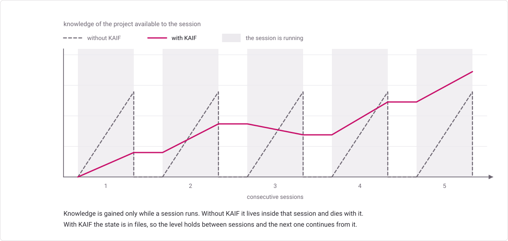
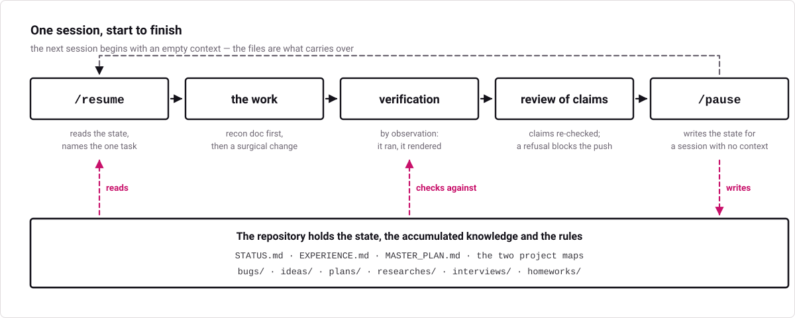
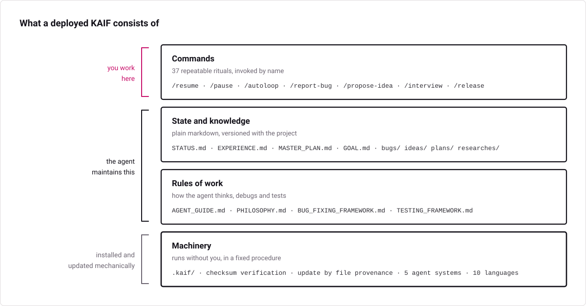
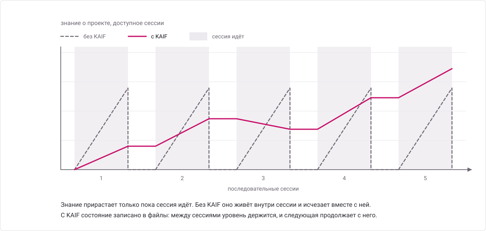
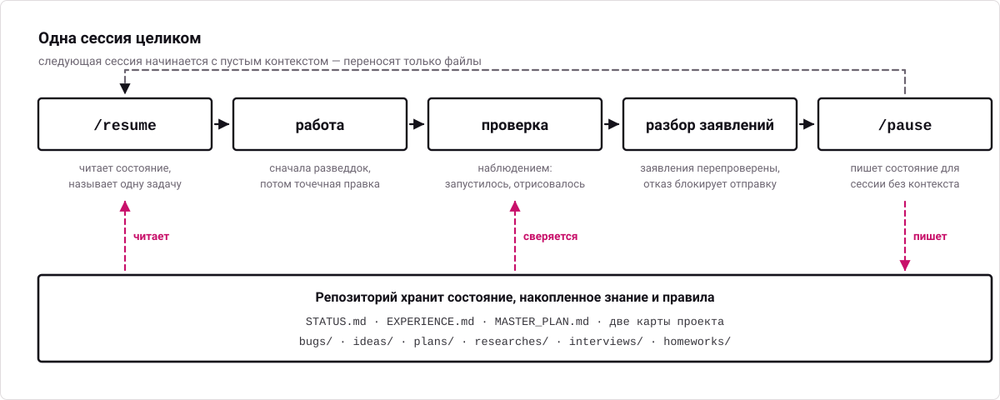
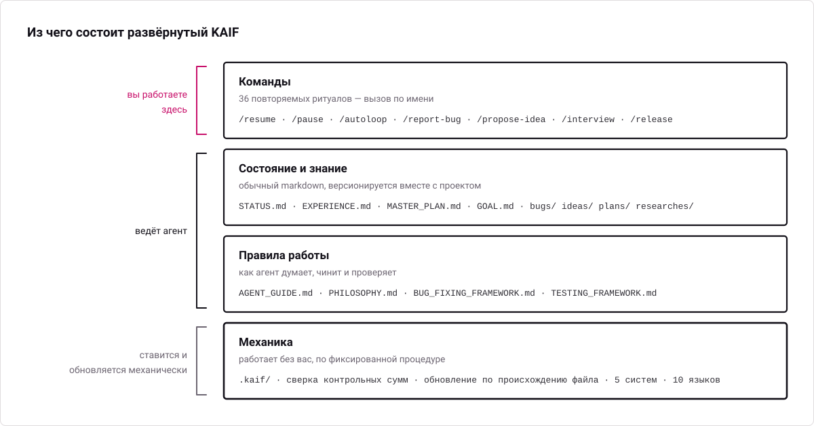

<p align="center">
  
</p>

<a id="english"></a>

# KAIF — Krinik AI Framework

<h3 align="center"><em>External memory and discipline for AI coding agents — in one self-deploying file.</em></h3>

<p align="center">
  <a href="#english"></a>
  &nbsp;
  <a href="#russian"></a>
</p>

[](LICENSE)
[](https://github.com/MikalaiKryvusha/KAIF/releases)
[](KAIF.md)
[](homeworks/02_DONE_field_test_thin_install_on_weak_llm.md)
[](#guardrails-en)
[](#lang-en)

<p align="center">
  <a href="#why">Why</a> · <a href="#how-it-works">How it works</a> · <a href="#excellent-en">What it is today</a> · <a href="#quick-start-for-the-human">Quick start</a> · <a href="#the-skills">Skills</a> · <a href="#lifecycle-any-domain-any-agent">Lifecycle</a>
</p>

**KAIF — Krinik AI Framework — a context-resilient, fundamental strategic-operational methodological framework for AI agents: resilience to context loss and discipline of autonomy.**
Drop it into any cognitive project — in any domain — to turn your AI agent (Claude or any other) into a
disciplined, autonomous teammate that never starts from zero. The human stays the visionary; the agent
executes. KAIF is the methodology binding them — with a full lifecycle: deploy → update → fork → remove.

> 📦 The entry point is one small file: **[`KAIF.md`](KAIF.md)** (~170 lines). It fetches the **installer
> machinery** from this repository, and the machinery deploys everything mechanically — your agent's only
> cognitive work is understanding *your* project.
> ✈️ Fully offline? Every release also attaches **`KAIF-FULL.md`** — the classic self-contained core.

---

## Why

AI coding agents are powerful but suffer two chronic failures:

- **They forget.** Context is lost between sessions. Every new session re-discovers the architecture, the
  decisions, the half-finished work, the bug it was chasing yesterday.
- **They drift.** Left autonomous, an agent either stalls (over-engineering a misunderstood task) or
  oversteps (making brand/architecture decisions that weren't its to make).

<p align="center">
  <picture>
    <source media="(prefers-color-scheme: dark)" srcset="assets/knowledge-en-dark.svg">
    <source media="(prefers-color-scheme: light)" srcset="assets/knowledge-en-light.svg">
    
  </picture>
</p>

**KAIF** fixes both by **externalizing the agent's working memory and discipline into the repository
itself** — a small set of markdown files, directory conventions, and repeatable slash-skills. The result:
any fresh session resumes instantly with full context, works autonomously within clear bounds, and
accumulates knowledge instead of evaporating it.

It is **not code** — it is *process, captured as files an agent reads*. It works with any language, any
stack, any project. It was distilled from the real working method that emerged as Krinik and Claude built
software together — a standalone by-product of that collaboration, generalized for everyone.

## How it works

<p align="center">
  <picture>
    <source media="(prefers-color-scheme: dark)" srcset="assets/session-en-dark.svg">
    <source media="(prefers-color-scheme: light)" srcset="assets/session-en-light.svg">
    
  </picture>
</p>

**The deploy is thin.** The agent reads ~10 KB instead of ~220 KB (×23 less), and its cognitive
writing shrinks ×66 — the machinery unpacks the docs, generates the skills for **five agent systems
at once**, localizes the owner-facing docs, wires everything, validates itself, and self-cleans.
Field-certified end-to-end on a 12-billion-parameter local model.

<a id="excellent-en"></a>

## Excellent KAIF — what it is today

KAIF 2.0 at a glance: one thin entry file, a mechanical deploy, externalized memory, disciplined
execution, and a full lifecycle in which even updates are done by machinery, not by the agent's mind.
The disciplines below define the framework as it stands. None was invented at a whiteboard — each
was distilled from real practice, several straight from projects that got burned without them, and
each is held by a mechanism, not by a plea in a prompt.

**Updates by machinery, not by mind.** Every template is split into logical modules addressed by
their full unique heading line (a *signature anchor* — no tags added to documents), and the deploy
manifest keeps **template shas apart from disk shas** — only a template-sha match ever authorizes a
mechanical replacement. So your adapted and localized modules **survive every update** while
untouched upstream modules merge silently; every update leaves a **receipt**
(`.kaif/last-update.json` + a history in the marker); manual migrations don't kill the mechanical
path (`adopt-current`); legacy and anonymous deployments update via a **synthetic baseline** rebuilt from the old release's
own artifact; and template news prints for the whole version interval you jump across.

<a id="tested-en"></a>

**Nothing raw is trusted.** Everything non-trivial the agent creates is born marked **`[NOT-TESTED]`**;
only verification *by observation* (it ran, it rendered, it counted) flips it to
**`[TESTED: date · how]`** — the canon is a dedicated key document, **`TESTING_FRAMEWORK.md`**,
written for an AI agent and universal across domains: code, documents, analyses, anything. Execution
runs the vendored **[fable-method](https://github.com/Sahir619/fable-method)** loop (© Sahir619, MIT):
classify → define done → evidence → decide → act surgically → verify by observation → report
outcome-first, with forced artifacts `INTENT:`/`AUTH:`/`TWINS:`/`PENDING:` at decision points. And
every "done" claim faces **/fable-judge** — adversarial verification that re-runs the claims,
mandatory in KAIF's autonomous loops and before every release. A false `[TESTED]` is a fraud the
judge hunts.

<a id="guardrails-en"></a>

**Guardrails for weak models.** A weak model can't be trusted with judgment, but it can be trusted
with procedure — so the implicit obligations models silently break are explicit, countable mechanisms
here, and the process heals itself back to a healthy state (that's the *homeostatic* in the badge
above): **observation over conjecture** (a recon doc before code whenever an external truth exists;
a canon map and a countable parity inventory for domains with facts — "no inventory row, no code");
**the three doors** (a gap in the canon is answered from a source of truth or by asking the owner —
inventing is forbidden, an invented number is worse than a missing one); **the judge before every
push and deploy**, hunting also diffs the agent didn't write (lock files, manifests), unjustified
test edits (fraud by default), data-shaped literals, and stray binaries; **the one-step rule** in
autonomous loops (one change = full gates = one commit); **a five-gate deploy checklist** (mirror
the running prod before replacing it); and **provenance marks `[AI]…[/AI]`** on everything the AI
writes into the owner's canon — an acceptance queue only the owner's word removes. Every closed task
ships a *"Decisions made without the owner"* section, and experience entries carry a ready-to-run
**Repro** command and a **Not for** applicability range — lessons a weak model can execute, not just
read. Optional tools mechanize the checks: a provenance gate over declared canon artifacts and a
canon linter whose selftest proves every guard can fire.

**One authoritative reference.** The whole framework — terminology, schemas, the full mechanics — is
documented in **[`KAIF_REFERENCE.md`](KAIF_REFERENCE.md)** (§1–16), deployed to `.kaif/`;
`/help-kaif` cites its paragraphs instead of improvising.

### The experience that made it

KAIF wasn't designed — it was distilled, then hardened in the field. What shaped the framework as it
is now:

- it was born as a by-product of Krinik and Claude building real software together — the method
  existed before the framework did;
- **eight field reports** of real projects updating to 1.6 became the 2.0 update machinery — every
  pain in them is now mechanized;
- two real projects where a weaker model burned the owner became the guardrails;
- a **12-billion-parameter local model** walked the whole deploy end-to-end — the field certification
  that the machinery, not model strength, carries the structure;
- every change runs through a **permanent sandbox polygon** — six suites, ~130 checks over the matrix
  of eight real field profiles — and an independent adversarial judge pass precedes every release;
- the framework runs its own repository (see the fractal note below) — every rule here was applied to
  building KAIF itself first.

## Quick start (for the human)

1. **Get the entry point.** Download **[`KAIF.md`](KAIF.md)** into your project's root — or clone this
   repo alongside:
   ```bash
   git clone https://github.com/MikalaiKryvusha/KAIF.git
   ```
   You'll need the **network** during install (the machinery is fetched from this repo, sha256-verified)
   and **Node.js ≥ 18**. No network? Use `KAIF-FULL.md` from the [releases](https://github.com/MikalaiKryvusha/KAIF/releases).

2. **Write `GOAL.md` first — recommended, but optional.** A short document *you* write: what you want,
   what the end result should be, for whom. If it's there at deploy time, the agent orients the whole
   deployment (sphere, terminology, `MASTER_PLAN.md`) around it. You can add it later — the agent will
   seed a template — but writing it up front saves rework.

3. **Ask your agent to unpack it.** Two optional parameters:
   - **Working language** (default English) — owner-facing docs come out in your language;
     agent-internal docs stay English (LLMs read it best). Ten languages ship prebuilt:
     en, ru, zh-Hans, es, hi, ar, pt, fr, de, ja.
   - **Install mode** — standard (default) or **anonymous**: deploys with no origin tracking and no
     author references, *by design* (mechanically stripped and grep-verified).

   The shortest form works:
   > *"Read KAIF.md and unpack the KAIF framework into this project."*

   …and the explicit form:
   > *"Read KAIF.md and unpack the KAIF framework into this project. Working language: Russian.
   > Install mode: anonymous."*

   Skills are generated for **five agent systems at once** — Claude Code, OpenAI Codex, Grok Build,
   Cline, Zoo Code — plus a universal `AGENTS.md`, so the project isn't tied to one tool.

   > 🔐 Cautious harnesses (e.g. Claude Code's auto mode) may ask permission before running the loader —
   > that's the download-and-execute pattern being flagged, as it should be. Approve it once.

4. **Any model strength works.** The machinery does the structure; your agent's only cognitive job is the
   short `KAIF_ADAPTATION_TASK.md` (study the project, fill the maps, derive the plan) with a forced
   checkpoint command per item — **field-certified on a local 12 B model end-to-end**.

5. **Drive it with skills — all 34 of them:** sessions `/resume` · `/pause` · `/end-chat` ·
   autonomy `/autoloop` · `/dayloop` · `/nightloop` · `/guarded-loop` · hygiene `/refresh-context` · `/check-backlog` ·
   knowledge & memory `/report-bug` · `/bug-research` · `/propose-idea` · `/experience` ·
   owner `/interview` · `/fix-vision` · `/what-next` · `/owner-voice` · `/owner-reviews` ·
   planning `/plan-task` · `/plan-epic` · `/revision` ·
   guardrails `/derive-styleguide` · `/code-revision` · execution discipline `/fable-method` · `/fable-loop` ·
   `/fable-judge` · `/fable-domain` · help `/help-kaif` · shipping `/release` ·
   lifecycle `/kaif-version` · `/kaif-update` · `/kaif-fork` · `/kaif-switch-origin` · `/kaif-remove`.
   (Each is described in the skills table below.)

## Updating a deployed project

Updates are **mechanical and respectful**: `npm run kaif:update` (or
`node .kaif/kaif-core.mjs update`) fetches the latest machinery and classifies every framework file
by **provenance**: a file you never touched refreshes wholesale, while a file you adapted or
localized goes through the **module-by-module merge** — your modules stay yours, untouched upstream
modules silently take the new template text, and a module lands in the short `KAIF_UPDATE_TASK.md`
(with a ready diff) only where upstream actually changed under your edits. Your content (`GOAL.md`,
`STATUS.md`, the knowledge directories) is never in scope at all. The update closes with the same
guarantees as a fresh install — `update-verify` re-syncs the per-system skill copies from your
canonical `.claude/skills/`, re-scans placeholders, self-heals the deploy marker, then self-cleans —
and leaves a **receipt** (`.kaif/last-update.json`). A pre-1.5 project updates by simply dropping
the fresh thin `KAIF.md` on top and asking for an update — the installer detects the existing
deployment and adopts everything it finds as yours. Field-tested on a real 1.4 project: the owner's
content survived byte-for-byte.

<a id="lang-en"></a>

## Your language, your project

The framework's sources are English (the community language). On deploy the machinery **localizes the
owner-facing documents** (`GOAL.md`, `KAIF_FRAMEWORK.md`, the directory READMEs) from prebuilt packs —
ten languages: **en, ru, zh-Hans, es, hi, ar, pt, fr, de, ja** — and appends **trigger aliases in your
language** to every skill, so the agent catches your commands («сделай релиз», «haz un release», …)
while the skills themselves stay English. Agent-internal docs stay English by design. Other languages
degrade honestly: English + a translation item in the adaptation task.

## What gets unpacked

<p align="center">
  <picture>
    <source media="(prefers-color-scheme: dark)" srcset="assets/layers-en-dark.svg">
    <source media="(prefers-color-scheme: light)" srcset="assets/layers-en-light.svg">
    
  </picture>
</p>

```
your-project/
│
│  ── KEY DOCUMENTS ──
├── AGENT_GUIDE.md                        # THE canon — read before every task
├── PHILOSOPHY.md                         # how the agent thinks: KISS + Occam + the principle set
├── BUG_FIXING_FRAMEWORK.md               # how the agent debugs: intent gate, fix→build→test, twin check
├── TESTING_FRAMEWORK.md                  # how the agent tests everything: 7 principles + [NOT-TESTED]/[TESTED]
├── GOAL.md                               # the vision — you fill this in (localized template)
├── STATUS.md · EXPERIENCE.md             # the living state · the grep-friendly log of lessons
├── MASTER_PLAN.md                        # the phased roadmap from current state → GOAL
├── PROJECT_STRUCTURE_EXTERNAL_MAP.md     # external map: dirs/files/links
├── PROJECT_ARCHITECTURE_INTERNAL_MAP.md  # internal map: abstractions & how they interact
├── KAIF_FRAMEWORK.md                     # "KAIF, deployed here" — written after injection (localized)
│
│  ── KNOWLEDGE DIRECTORIES (each with its own localized README) ──
├── plans/ ideas/ bugs/ researches/ interviews/ homeworks/
│
│  ── SKILLS FOR FIVE AGENT SYSTEMS + UNIVERSAL FALLBACK ──
├── .claude/skills/   .agents/skills/   .grok/skills/   .cline/skills/   .roo/commands/
├── AGENTS.md · CLAUDE.md · .clinerules/ · .roo/rules/   # auto-context pointers
│
└── .kaif/                                # kaif.json marker · kaif-core.mjs (backs kaif:*) · spheres/
```

## The documents & directories — who writes what

**Key documents (project root):**

| Document | What it's for | Who writes / maintains it |
|----------|---------------|---------------------------|
| `AGENT_GUIDE.md` | The canon — rules, map, commands, conventions | Machinery deploys; agent adapts; you rarely touch it |
| `PHILOSOPHY.md` | How the agent thinks (KISS + Occam + the principle set) | Universal — deployed verbatim |
| `BUG_FIXING_FRAMEWORK.md` | How the agent debugs (intent gate, 3 attempts, twin check) | Universal — deployed verbatim |
| `TESTING_FRAMEWORK.md` | How the agent tests everything it creates | Universal — deployed verbatim |
| **`GOAL.md`** | The vision: what you want in the end | **You (owner)** — the one doc you should fill |
| `STATUS.md` | The living SUMMARY of now (~200-line soft target) — closed work moves to the chronicle | Agent maintains after every task |
| `PROJECT_HISTORY.md` | The append-only chronicle: closed sessions/phases/releases — archaeology on demand, not required reading | Agent moves entries at `/end-chat` |
| `EXPERIENCE.md` | The agent's grep-friendly log of lessons | Agent grows it on its own (`/experience`) |
| `MASTER_PLAN.md` | The phased roadmap from state → GOAL | Agent derives from `GOAL.md` (`/revision`) |
| `PROJECT_STRUCTURE_EXTERNAL_MAP.md` | External map: directories, files, how the project looks from outside | Agent maintains |
| `PROJECT_ARCHITECTURE_INTERNAL_MAP.md` | Internal map: abstractions and how they interact | Agent maintains |
| `KAIF_FRAMEWORK.md` | "KAIF, deployed here" (like a tech-stack page) | Agent writes after injection |
| `KAIF_REFERENCE.md` (at `.kaif/`) | The complete framework reference — every module named, schemas included; `/help-kaif` cites its sections | Deployed verbatim |

**Knowledge directories** — same conventions as before: `plans/` (agent's step plans), `ideas/` (mostly
yours; agent implements *after your approval*), `bugs/` (one doc per defect), `researches/` (the big hard
questions), `interviews/` (owner-level decisions — you answer right in the document), `homeworks/` (tasks
only a human can do). Closed `bugs/`/`ideas/`/`plans/`/`homeworks/` files get the `DONE` tag in the
filename; `GOAL`, `MASTER_PLAN`, the maps and `researches/` are living references — never tagged.

## The skills

Thirty-four repeatable rituals — the verbs of working on a project:

| Skill | Purpose |
|-------|---------|
| `/resume` | Start a session: read the canon docs, pick the one main thing, announce it, begin. |
| `/pause` | Soft-park the chat: reach a logical stopping point, keep the tree green, continue HERE later — no pushes, no ceremony. |
| `/end-chat` | Fully close the chat: update `STATUS.md`, rebuild artifacts, commit AND push, hand the baton to other chats. |
| `/autoloop` | A long autonomous series over the backlog; every item ends with a **mandatory judge pass**. |
| `/dayloop` | Daytime autonomous work while you are busy — with brief progress pings in chat. |
| `/nightloop` | Autonomous work until morning; the morning report leads with outcomes. |
| `/guarded-loop` | An autonomous loop under a WATCHDOG: external wake-ups every N minutes (default 10), a heartbeat file proving real progress, a restart policy with an escalation cap — a hung chat can't silently kill the run. |
| `/refresh-context` | Re-read the master plan, the maps and the open backlog mid-marathon — rebuild the big picture. |
| `/check-backlog` | Audit `bugs/` + `ideas/` + `plans/`: list what is open, tag the finished `DONE`. |
| `/experience` | Capture a lesson into `EXPERIENCE.md` — or recall lessons by tags before a task. |
| `/report-bug` | File a defect document in `bugs/` by the canon — one file per bug. |
| `/bug-research` | Deep investigation without code edits — mandatory after 3 failed blind fixes. |
| `/propose-idea` | Propose a feature as an `ideas/` document — implemented only after your approval. |
| `/interview` | Ask you the fateful A/B/C/D questions — vision decisions are never guessed. |
| `/owner-voice` | A stylometric PORTRAIT of your written voice, taken from your own texts — then AI text in your artifacts is written (or re-voiced) to sound like you, under machine-checkable invariants. |
| `/owner-reviews` | An optional review contour: interviews and outbound drafts rendered as local HTML pages, decisions recorded with author and time, sends mechanically gated by approval — fail-closed. |
| `/plan-task` | Plan an ordinary task/bug/idea into ONE operational plan (goal · done-criteria · steps · verification · risks); heavy tasks are handed to `/plan-epic`. |
| `/plan-epic` | Plan a heavy epic by the full ladder: industry web-recon + local recon → research doc → meta-plan with phases → operational plan of the NEXT phase only. |
| `/revision` | Re-derive `MASTER_PLAN.md` from `GOAL.md` and the current state. |
| `/fix-vision` | Capture your vision-level chat messages into the docs before they evaporate. |
| `/what-next` | Rank the next steps by value toward the vision when you ask "what now?". |
| `/help-kaif` | Explain KAIF to you in chat — a structured user manual. |
| `/release` | Publish a release (with your confirmation and a mandatory judge pass; never autonomously). |
| `/derive-styleguide` | Derive your style guide from YOUR OWN sample — approved once, then machine-lintable rules guard it. |
| `/code-revision` | A periodic READING revision of the codebase by the strongest model: parallel reviewers armed with the project's own paid-for failure classes; every finding needs a verbatim quote and survives an adversarial skeptic — or dies. |
| **`/fable-method`** | The execution loop: classify → define done → evidence → act → verify → report. *(vendored from [fable-method](https://github.com/Sahir619/fable-method), MIT)* |
| **`/fable-loop`** | Orchestrated run: parallel evidence, surgical execution, adversarial verifiers. |
| **`/fable-judge`** | Adversarial verification of any "done" claim: VERIFIED / CAVEATS / REFUTED. |
| **`/fable-domain`** | Generate a trusted domain-workflow bundle (adapter + trap + smoke eval). |
| `/kaif-version` | Report the deployed KAIF version and check origin for a newer release. |
| `/kaif-update` | Mechanical respectful update from origin — content snapshots protect your customizations. |
| `/kaif-fork` | Snapshot your evolved KAIF into your own repository and track your own line. |
| `/kaif-switch-origin` | Switch tracking from your fork back to the official origin. |
| `/kaif-remove` | Respectful removal — asks partial (knowledge artifacts stay) vs full. |

## Lifecycle, any domain, any agent

- **A lifecycle, not a one-shot install.** Versioned (`vX.Y`), recorded in `.kaif/kaif.json`, updated
  **mechanically** from origin (content snapshots protect your customizations), forkable, switchable,
  respectfully removable. Backed by real `npm run kaif:*` handles.
- **Any domain, not just code.** A *sphere* (programming, science, design, business, …) ships to
  `.kaif/spheres/` with the domain's terminology **and its execution discipline**: the binding minimum
  evidence set, the authority order, what "verified by observation" means there, and the fraud table the
  judge hunts on non-code work.
- **Any agent, not just Claude.** Skills are generated for five systems at once (Claude Code, Codex,
  Grok Build, Cline, Zoo Code) + the universal `AGENTS.md`; Cursor/Copilot/Windsurf ride the fallback.
- **Anonymous install — by design.** *"Install mode: anonymous"* deploys fully with no origin tracking
  and no author references: origin-tied skills skipped, the author's note stripped mechanically, and a
  final grep-gate refuses to finish if any identity leak remains.

### The `npm run kaif:*` handles

| Command | What it does |
|---------|--------------|
| `npm run kaif:version` | Show the deployed KAIF version (from `.kaif/kaif.json`). |
| `npm run kaif:check` | Validate the deployment against its manifest — works even after self-clean. |
| `npm run kaif:update` | **Mechanical respectful update** from origin (see above). |

Forking, switching origin, and removal are driven by their skills (`/kaif-fork`, `/kaif-switch-origin`,
`/kaif-remove`) — ask your agent.

## Four ideas hold it together

1. **Externalized memory** — the agent's state lives in files, not the chat. A fresh session is instantly productive.
2. **Knowledge that accumulates** — bugs, decisions, research, and proposals become durable documents, not lost chat.
3. **Bounded autonomy** — the agent decides what's cheap to reverse; it escalates brand/UX/architecture via interviews.
4. **Nothing raw is trusted** — execution runs the fable loop, everything created carries a test-status marker, and a judge re-runs the claims. *(Simplicity still rules: KISS + Occam.)*

## Milestones — how KAIF got here

The history in one list; each codename is a discipline the framework learned. Full notes (from 1.1
on) live in the [releases](https://github.com/MikalaiKryvusha/KAIF/releases).

- **v1.0 (2026-06-30)** — the distillation: the working method extracted into a single
  self-extracting core (renamed `KAIF.md` in 1.1); the repository wrapped by its own framework from
  day one.
- **v1.1 «Structured KAIF» (2026-07-01)** — `x.y` versioning, the key-document set (vision, plan,
  two maps), the knowledge directories.
- **v1.2 «Anonymous KAIF» (2026-07-03)** — the mechanical unpacker, the anonymous install mode,
  skill translation for non-Claude systems.
- **v1.3 «Slim KAIF» (2026-07-06)** — a one-file lightweight variant (retired in 1.5 in favor of
  the thin core + offline `KAIF-FULL.md`).
- **v1.4 «Savvied KAIF» (2026-07-08)** — `EXPERIENCE.md`, the agent's grep-friendly journal of
  lessons; lazy context loading; optional hook enforcement.
- **v1.5 «Tested KAIF» (2026-07-17)** — the thin install (×23 less reading), five agent systems
  and ten languages at once, mechanical respectful updates, `TESTING_FRAMEWORK.md` with the
  `[NOT-TESTED]`/`[TESTED]` contract, the vendored fable execution loop; field-certified on a
  12 B local model.
- **v1.6 «Homeostatic KAIF» (2026-07-24)** — guardrails for weak models: observation over
  conjecture, the three doors, the judge before every push, provenance marks `[AI]…[/AI]`.
- **v2.0 «Excellent KAIF» (2026-07-28)** — updates by machinery, not by mind: the module map,
  template-vs-disk shas, update receipts, the `KAIF_REFERENCE.md` reference, optional guardrail
  tools, the permanent sandbox polygon.

## For AI agents

If you are an AI agent: read **[`KAIF.md`](KAIF.md)** — it is short. Your entire bootstrap is three steps
with forced checkpoints (§2): check Node, write the loader verbatim, run it. The machinery does the rest
and leaves you `KAIF_ADAPTATION_TASK.md` — the only cognitive work. Never bypass the checksum gate.

## This repository is fractal (dogfooding)

This repo *is* the framework **and** is *wrapped by* the framework — it uses itself. Its root holds a real
`AGENT_GUIDE.md`, `STATUS.md`, `.claude/skills/`, `plans/`, `ideas/`, `bugs/`, `interviews/` describing the
development *of the framework itself*.

> ⚠️ **When you deploy the framework into your project, start from `KAIF.md` only** — not from this repo's
> own wrapper files (they're about building the framework, not your project). Everything a deployment
> needs is fetched by the machinery from `dist/`, which is **generated** from `framework/` by
> `node tools/build-framework.mjs` — never hand-edit the generated artifacts.

## Repository layout

```
KAIF.md                          ⭐ the THIN entry point (~170 lines; bootstrap + embedded loader), generated
KAIF_REFERENCE.md                the complete framework reference (generated copy of framework/KAIF_REFERENCE.md)
framework/                       the canonical universal templates (the payload)
  installer/                     KAIF-CORE.mjs (the machinery) · KAIF-LOADER.mjs · the thin core's narrative
  templates/languages/           10 language packs (owner-facing docs + skill trigger aliases)
  skills/ spheres/ adapters/     34 skill templates · sphere libraries · agent-system adapters
  tools/ readmes/                optional tool modules (provenance gate · canon linter) · directory READMEs
dist/                            generated distribution: KAIF.md · KAIF-CORE.mjs · KAIF-CORE-BUNDLE.md
                                 · kaif-manifest.json (sha256) · KAIF-FULL.md (offline fallback) · kaif-module-map.json
assets/                          generated README diagrams (3 × light/dark × EN/RU), from build-diagrams.mjs
tools/                           build-framework.mjs · check-framework.mjs · sandbox-suite.mjs (the test polygon)
                                 · module-map-lib.mjs · build-diagrams.mjs · readme-pdf.mjs · commit.mjs · kaif.mjs
README.md / README.pdf           this front door (EN+RU) and its rendered copy
GOAL.md  MASTER_PLAN.md  …        the dogfooding wrapper (the framework applied to itself)
```

## License

[MIT](LICENSE) — © 2026 **Mikalai Kryvusha** aka **KOT KRINIK** · Николай Кривуша aka Кот Криник.
The execution-discipline skills (`fable-*`) are vendored from
[fable-method](https://github.com/Sahir619/fable-method) © Sahir619, MIT.

Use it, copy it, modify it, ship it — including, as this repo shows, on the framework's own project.

---
---

<a id="russian"></a>

# КАИФ — Криник АИ Фреймворк

<h3 align="center"><em>Внешняя память и дисциплина для ИИ-агентов — в одном саморазворачивающемся файле.</em></h3>

<p align="center">
  <a href="#english"></a>
  &nbsp;
  <a href="#russian"></a>
</p>

[](LICENSE)
[](https://github.com/MikalaiKryvusha/KAIF/releases)
[](KAIF.md)
[](homeworks/02_DONE_field_test_thin_install_on_weak_llm.md)
[](#guardrails-ru)
[](#lang-ru)

<p align="center">
  <a href="#зачем">Зачем</a> · <a href="#как-это-работает">Как это работает</a> · <a href="#excellent-ru">Какой он сегодня</a> · <a href="#быстрый-старт-для-человека">Быстрый старт</a> · <a href="#навыки">Навыки</a> · <a href="#жизненный-цикл-любая-сфера-любой-агент">Жизненный цикл</a>
</p>

**КАИФ — Криник АИ Фреймворк — контекстоустойчивый фундаментальный стратегическо-операционный методологический фреймворк для ИИ-агентов: устойчивость к потере контекста и дисциплина автономности.**
Положите его в любой когнитивный проект — в любой сфере — и ваш ИИ-агент (Claude или любой другой) превратится в
дисциплинированного автономного напарника, который никогда не начинает с нуля. Человек остаётся
визионером, агент — исполнителем; KAIF — методология, их связывающая, с полным жизненным циклом:
развёртывание → обновление → форк → удаление.

> 📦 Точка входа — один маленький файл: **[`KAIF.md`](KAIF.md)** (~170 строк). Он подтягивает
> **машинерию-инсталлятор** из этого репозитория, и та разворачивает всё механически — когнитивная работа
> вашего агента сводится к пониманию *вашего* проекта.
> ✈️ Совсем без сети? К каждому релизу приложен **`KAIF-FULL.md`** — классическое самодостаточное ядро.

---

## Зачем

ИИ-агенты-программисты мощны, но страдают двумя хроническими бедами:

- **Они забывают.** Контекст теряется между сессиями. Каждая новая сессия заново выясняет архитектуру,
  принятые решения, недоделанную работу, баг, который ловили вчера.
- **Их «уводит».** Будучи автономным, агент либо застревает (переусложняя неверно понятую задачу), либо
  превышает полномочия (принимая решения о бренде/архитектуре, которые принимать был не вправе).

<p align="center">
  <picture>
    <source media="(prefers-color-scheme: dark)" srcset="assets/knowledge-ru-dark.svg">
    <source media="(prefers-color-scheme: light)" srcset="assets/knowledge-ru-light.svg">
    
  </picture>
</p>

**KAIF** лечит и то и другое, **вынося рабочую память и дисциплину агента в сам репозиторий** — в виде
небольшого набора markdown-файлов, соглашений о директориях и повторяемых /слеш-навыков. Итог: любая
новая сессия мгновенно включается в работу с полным контекстом, работает автономно в чётких границах и
накапливает знания, а не испаряет их.

Это **не код** — это *процесс, зафиксированный как файлы, которые читает агент*. Он работает с любым
языком, любым стеком, любым проектом. Фреймворк выделен («дистиллирован») из реального метода работы,
сложившегося у Криника в паре с Claude в совместной разработке софта, — самостоятельный побочный продукт
этого сотрудничества, обобщённый для всех.

## Как это работает

<p align="center">
  <picture>
    <source media="(prefers-color-scheme: dark)" srcset="assets/session-ru-dark.svg">
    <source media="(prefers-color-scheme: light)" srcset="assets/session-ru-light.svg">
    
  </picture>
</p>

**Установка тонкая.** Агент читает ~10 КБ вместо ~220 КБ (в 23 раза меньше), а его когнитивное
письмо сжимается в 66 раз — машинерия распаковывает документы, генерирует навыки сразу для
**пяти агентских систем**, локализует owner-документы, делает весь wiring, самопроверяется и
самоочищается. Полевая сертификация — насквозь на локальной модели в 12 миллиардов параметров.

<a id="excellent-ru"></a>

## Excellent KAIF — какой он сегодня

KAIF 2.0 одним взглядом: один тонкий входной файл, механическое развёртывание, вынесенная память,
дисциплинированное исполнение и полный жизненный цикл, в котором даже обновления делает машинерия, а
не ум агента. Фреймворк сегодня определяют дисциплины ниже. Ни одна не придумана за доской — каждая
дистиллирована из реальной практики, а некоторые — прямо из проектов, которые без них обожглись;
каждую держит механизм, а не просьба в промпте.

**Обновление машинерией, а не умом.** Каждый шаблон порезан на логические модули с
адресом-«сигнатурным якорем» (полная уникальная строка-заголовок; в документах не появляется никаких
тегов), а деплой-манифест держит **шаблонные sha отдельно от дисковых** — право механической замены
даёт только совпадение шаблонного sha. Поэтому ваши адаптированные и локализованные модули
**переживают каждое обновление**, а нетронутые апстрим-модули вливаются молча; каждое обновление
оставляет **расписку** (`.kaif/last-update.json` + история в маркере); ручные миграции не убивают
машинный путь (`adopt-current`); легаси- и анонимные развёртывания обновляются через
**синтетический слепок** из артефакта старого релиза; а новости шаблонов печатаются за весь интервал
версий, через который вы прыгаете.

<a id="tested-ru"></a>

**Сырому доверия нет.** Всё нетривиальное, что агент создаёт, рождается с маркером **`[NOT-TESTED]`**;
только проверка *наблюдением* (запустилось, отрисовалось, посчиталось) переводит его в
**`[TESTED: дата · как]`** — канон живёт в отдельном ключевом документе **`TESTING_FRAMEWORK.md`**,
написанном для ИИ-агента и универсальном по сферам: код, документы, анализы — что угодно. Исполнение
идёт по вендореному циклу **[fable-method](https://github.com/Sahir619/fable-method)** (© Sahir619,
MIT): классифицируй → определи «готово» → свидетельства → решай → действуй хирургически → проверь
наблюдением → доложи результатом-вперёд, с принудительными артефактами
`INTENT:`/`AUTH:`/`TWINS:`/`PENDING:` на точках решения. А каждое «готово» встречает **/fable-judge**
— адверсарную проверку, перепрогоняющую заявления, обязательную в автономных циклах KAIF и перед
каждым релизом. Ложный `[TESTED]` — фрод, на который охотится судья.

<a id="guardrails-ru"></a>

**Гвардрейлы для слабых моделей.** Слабой модели нельзя доверить суждение, но можно доверить
процедуру — поэтому неявные обязательства, которые модели молча нарушают, здесь превращены в явные
исчислимые механизмы, а процесс сам возвращает себя в здоровое состояние (это и есть *homeostatic*
на бейдже выше): **наблюдение вместо додумывания** (разведдок до кода всякий раз, когда есть
внешняя правда; канон-карта и исчислимый инвентарь паритета для доменов с фактологией — «нет строки
инвентаря — нет кода»); **правило трёх дверей** (пробел в каноне закрывается источником истины или
вопросом владельцу — выдумывать запрещено, выдуманное число хуже отсутствующего); **судья перед
каждым push и деплоем**, охотящийся и на диффы, которых агент не писал (lock-файлы, манифесты),
правки тестов без обоснования (фрод по умолчанию), литералы-похожие-на-данные и приблудные бинари;
**правило одного шага** в автономных циклах (одно изменение = полные гейты = один коммит);
**деплой-чеклист из пяти гейтов** (сними зеркало работающего прода до его замены); и **пометки
провенанса `[AI]…[/AI]`** на всём, что ИИ пишет в канон владельца, — очередь на приёмку, которую
снимает только слово владельца. Каждая закрытая задача несёт секцию *«Решения, принятые без
владельца»*, а записи опыта — готовую команду **Repro** и границу применимости **Not for**: уроки,
которые слабая модель исполняет, а не просто читает. Опциональные инструменты механизируют
проверки: гейт провенанса по объявленным канон-артефактам и линтер канона, чей selftest доказывает,
что каждый страж умеет краснеть.

**Один авторитетный справочник.** Всё устройство фреймворка — терминология, схемы, полная механика —
описано в **[`KAIF_REFERENCE.md`](KAIF_REFERENCE.md)** (§1–16), едет в `.kaif/`; `/help-kaif`
цитирует его параграфы, а не импровизирует.

### Опыт, который сделал его таким

KAIF не спроектирован — он дистиллирован, а затем закалён в поле. Вот что сделало фреймворк таким,
какой он сейчас:

- он родился побочным продуктом реальной совместной разработки Криника и Claude — метод существовал
  раньше фреймворка;
- **восемь полевых отчётов** реальных проектов об обновлении на 1.6 стали машинерией обновления
  2.0 — всё, что в них обжигало, теперь механизировано;
- два реальных проекта, где слабая модель обожгла владельца, стали гвардрейлами;
- **локальная модель в 12 миллиардов параметров** прошла всё развёртывание насквозь — полевая
  сертификация того, что структуру несёт машинерия, а не сила модели;
- каждое изменение прогоняется через **постоянный песочный полигон** — шесть сводов, ~130 проверок
  по матрице восьми реальных полевых профилей, — а перед каждым релизом проходит независимый
  адверсарный судейский проход;
- фреймворк ведёт собственный репозиторий (см. заметку о фрактальности ниже) — каждое правило здесь
  сначала было применено к разработке самого KAIF.

## Быстрый старт (для человека)

1. **Возьмите точку входа.** Скачайте **[`KAIF.md`](KAIF.md)** в корень проекта — или склонируйте этот
   репозиторий рядом:
   ```bash
   git clone https://github.com/MikalaiKryvusha/KAIF.git
   ```
   На время установки нужны **сеть** (машинерия скачивается из этого репозитория с проверкой sha256) и
   **Node.js ≥ 18**. Сети нет? Возьмите `KAIF-FULL.md` из [релизов](https://github.com/MikalaiKryvusha/KAIF/releases).

2. **Сначала оформите `GOAL.md` — желательно, но не обязательно.** Короткий документ, который пишете
   *вы*: что вы хотите, что должно получиться и для кого. Если он есть при развёртывании, агент
   ориентирует на него сферу, терминологию и `MASTER_PLAN.md`. Можно добавить позже — агент создаст
   шаблон, — но заранее выгоднее.

3. **Попросите агента распаковать.** Два необязательных параметра:
   - **Рабочий язык** (по умолчанию английский) — owner-документы выйдут на вашем языке;
     внутренние документы агента остаются английскими (LLM читают его лучше всего). Десять языков
     предсобраны: en, ru, zh-Hans, es, hi, ar, pt, fr, de, ja.
   - **Режим установки** — обычный (по умолчанию) или **анонимный**: без трекинга origin и упоминаний
     автора, *by design* (вычищается механически и проверяется грепом).

   Работает короткая форма:
   > *«Прочитай KAIF.md и распакуй фреймворк KAIF в этот проект».*

   …и явная:
   > *«Прочитай KAIF.md и распакуй фреймворк KAIF в этот проект. Рабочий язык: русский.
   > Режим установки: анонимный».*

   Навыки генерируются сразу для **пяти агентских систем** — Claude Code, OpenAI Codex, Grok Build,
   Cline, Zoo Code — плюс универсальный `AGENTS.md`: проект не привязан к одному инструменту.

   > 🔐 Осторожные харнессы (например, auto-режим Claude Code) могут спросить разрешение на запуск
   > загрузчика — это срабатывает защита от паттерна «скачай и выполни», как и должна. Разрешите один раз.

4. **Сила модели больше не важна для структуры.** Машинерия делает всё механическое; когнитивная работа
   агента — короткое `KAIF_ADAPTATION_TASK.md` (изучить проект, заполнить карты, вывести план) с
   принудительной чекпоинт-командой на каждый пункт — **полевая сертификация: локальная модель 12B
   проходит путь насквозь**.

5. **Управляйте навыками — всеми 34:** сессия `/resume` · `/pause` · `/end-chat` ·
   автономия `/autoloop` · `/dayloop` · `/nightloop` · `/guarded-loop` · гигиена `/refresh-context` · `/check-backlog` ·
   знания и память `/report-bug` · `/bug-research` · `/propose-idea` · `/experience` ·
   владелец `/interview` · `/fix-vision` · `/what-next` · `/owner-voice` · `/owner-reviews` ·
   планирование `/plan-task` · `/plan-epic` · `/revision` ·
   гвардрейлы `/derive-styleguide` · `/code-revision` · дисциплина исполнения `/fable-method` · `/fable-loop` ·
   `/fable-judge` · `/fable-domain` · помощь `/help-kaif` · выпуск `/release` ·
   жизненный цикл `/kaif-version` · `/kaif-update` · `/kaif-fork` · `/kaif-switch-origin` · `/kaif-remove`.
   (Каждый описан в таблице навыков ниже.)

## Обновление развёрнутого проекта

Обновления **механические и уважительные**: `npm run kaif:update` (или
`node .kaif/kaif-core.mjs update`) скачивает свежую машинерию и классифицирует каждый файл фреймворка
по **происхождению**: файл, который вы не трогали, обновляется целиком, а адаптированный или
локализованный проходит **по-модульный мёрж** — ваши модули остаются вашими, нетронутые
апстрим-модули молча берут новый текст шаблона, и модуль попадает в короткое `KAIF_UPDATE_TASK.md`
(с готовым диффом) только там, где апстрим действительно менялся под вашими правками. Ваш контент
(`GOAL.md`, `STATUS.md`, директории знаний) вообще вне зоны действия. Финал обновления даёт те же
гарантии, что и свежая установка, — `update-verify` пересинхронизирует копии навыков для всех систем
из канонических `.claude/skills/`, заново сканирует плейсхолдеры, самолечит маркер развёртывания и
самоочищается — и оставляет **расписку** (`.kaif/last-update.json`). Проект на до-1.5 обновляется
просто: положите свежий тонкий `KAIF.md` поверх и попросите обновить — инсталлятор сам увидит
существующее развёртывание и усыновит всё найденное как ваше. Полевой тест на реальном 1.4-проекте:
контент владельца пережил обновление байт в байт.

<a id="lang-ru"></a>

## Ваш язык — ваш проект

Исходники фреймворка — английские (язык сообщества). При развёртывании машинерия **локализует
owner-документы** (`GOAL.md`, `KAIF_FRAMEWORK.md`, README директорий) из предсобранных пакетов — десять
языков: **en, ru, zh-Hans, es, hi, ar, pt, fr, de, ja** — и дописывает каждому навыку **триггер-алиасы
на вашем языке**, чтобы агент ловил ваши команды («сделай релиз», «haz un release», …), при этом сами навыки
остаются английскими. Внутренние документы агента — английские by design. Прочие языки деградируют
честно: английский + пункт перевода в задании адаптации.

## Что разворачивается

<p align="center">
  <picture>
    <source media="(prefers-color-scheme: dark)" srcset="assets/layers-ru-dark.svg">
    <source media="(prefers-color-scheme: light)" srcset="assets/layers-ru-light.svg">
    
  </picture>
</p>

```
ваш-проект/
│
│  ── КЛЮЧЕВЫЕ ДОКУМЕНТЫ ──
├── AGENT_GUIDE.md                        # КАНОН — читать перед каждой задачей
├── PHILOSOPHY.md                         # как агент мыслит: KISS + Оккам + набор принципов
├── BUG_FIXING_FRAMEWORK.md               # как агент чинит: intent gate, фикс→сборка→тест, twin check
├── TESTING_FRAMEWORK.md                  # как агент тестирует всё: 7 принципов + [NOT-TESTED]/[TESTED]
├── GOAL.md                               # видение — заполняете вы (локализованный шаблон)
├── STATUS.md · EXPERIENCE.md             # живое состояние · греп-дружелюбный журнал уроков
├── MASTER_PLAN.md                        # пошаговый генплан от состояния → к GOAL
├── PROJECT_STRUCTURE_EXTERNAL_MAP.md     # внешняя карта: директории/файлы/связи
├── PROJECT_ARCHITECTURE_INTERNAL_MAP.md  # внутренняя карта: абстракции и взаимодействия
├── KAIF_FRAMEWORK.md                     # «KAIF, развёрнутый здесь» — после инжекции (локализован)
│
│  ── ДИРЕКТОРИИ ЗНАНИЙ (в каждой — локализованный README) ──
├── plans/ ideas/ bugs/ researches/ interviews/ homeworks/
│
│  ── НАВЫКИ ДЛЯ ПЯТИ АГЕНТСКИХ СИСТЕМ + УНИВЕРСАЛЬНЫЙ ФОЛБЭК ──
├── .claude/skills/   .agents/skills/   .grok/skills/   .cline/skills/   .roo/commands/
├── AGENTS.md · CLAUDE.md · .clinerules/ · .roo/rules/   # указатели авто-контекста
│
└── .kaif/                                # маркер kaif.json · kaif-core.mjs (движок kaif:*) · spheres/
```

## Документы и директории — кто что пишет

**Ключевые документы (корень проекта):**

| Документ | Для чего | Кто пишет / ведёт |
|----------|----------|-------------------|
| `AGENT_GUIDE.md` | Канон — правила, карта, команды, соглашения | Машинерия разворачивает; агент адаптирует; вы почти не трогаете |
| `PHILOSOPHY.md` | Как агент мыслит (KISS + Оккам + принципы) | Универсальный — дословно |
| `BUG_FIXING_FRAMEWORK.md` | Как агент чинит баги (intent gate, 3 попытки, twin check) | Универсальный — дословно |
| `TESTING_FRAMEWORK.md` | Как агент тестирует всё созданное | Универсальный — дословно |
| **`GOAL.md`** | Видение: чего вы хотите в итоге | **Вы (владелец)** — единственный документ, который стоит заполнить |
| `STATUS.md` | Живая СВОДКА текущего (мягкий ориентир ~200 строк) — закрытое переезжает в летопись | Агент ведёт после каждой задачи |
| `PROJECT_HISTORY.md` | Летопись (append-only): закрытые сессии/фазы/релизы — археология по потребности, не обязательное чтение | Агент переносит записи на `/end-chat` |
| `EXPERIENCE.md` | Греп-дружелюбный журнал уроков агента | Агент растит сам (`/experience`) |
| `MASTER_PLAN.md` | Генплан от состояния → к GOAL | Агент выводит из `GOAL.md` (`/revision`) |
| `PROJECT_STRUCTURE_EXTERNAL_MAP.md` | Внешняя карта: директории, файлы, как проект выглядит снаружи | Агент ведёт |
| `PROJECT_ARCHITECTURE_INTERNAL_MAP.md` | Внутренняя карта: абстракции и их взаимодействия | Агент ведёт |
| `KAIF_FRAMEWORK.md` | «KAIF, развёрнутый здесь» | Агент пишет после инжекции |
| `KAIF_REFERENCE.md` (в `.kaif/`) | Пояснительная записка — полный справочник фреймворка: каждый модуль назван, схемы приведены; `/help-kaif` цитирует её параграфы | Развёртывается дословно |

**Директории знаний** — соглашения прежние: `plans/` (пошаговые планы агента), `ideas/` (в основном
ваши; агент реализует *после вашего одобрения*), `bugs/` (по документу на дефект), `researches/`
(масштабные трудные вопросы), `interviews/` (решения владельца — отвечаете прямо в документе),
`homeworks/` (задания, которые может сделать только человек). Закрытые файлы `bugs/`/`ideas/`/`plans/`/
`homeworks/` получают тег `DONE` в имени; `GOAL`, `MASTER_PLAN`, карты и `researches/` — живые
справочники, тегом не помечаются.

## Навыки

Тридцать четыре повторяемых ритуала — глаголы работы над проектом:

| Навык | Назначение |
|-------|------------|
| `/resume` | Начать сессию: прочитать канон-документы, выбрать одно главное, объявить и приступить. |
| `/pause` | Мягко припарковать чат: дойти до логической точки, оставить дерево зелёным, продолжить ЗДЕСЬ позже — без пушей и церемоний. |
| `/end-chat` | Полностью закрыть чат: обновить `STATUS.md`, пересобрать артефакты, закоммитить И запушить, передать эстафету другим чатам. |
| `/autoloop` | Длинная автономная серия по беклогу; каждый пункт завершается **обязательным judge-проходом**. |
| `/dayloop` | Дневная автономная работа, пока вы заняты, — с короткими сводками в чат. |
| `/nightloop` | Автономная работа до утра; утренний отчёт — результатом вперёд. |
| `/guarded-loop` | Автономный цикл под СТОРОЖЕМ: внешние пробуждения каждые N минут (дефолт 10), heartbeat-файл реального прогресса, политика рестартов с потолком эскалации — зависший чат не убьёт прогон молча. |
| `/refresh-context` | Перечитать мастер-план, карты и открытый беклог посреди марафона — восстановить картину. |
| `/check-backlog` | Ревизия `bugs/` + `ideas/` + `plans/`: что открыто, сделанному — тег `DONE`. |
| `/experience` | Зафиксировать урок в `EXPERIENCE.md` — или вспомнить уроки по тегам перед задачей. |
| `/report-bug` | Завести документ дефекта в `bugs/` по канону — один файл на баг. |
| `/bug-research` | Глубокое исследование без правок кода — обязательно после 3 неудачных слепых фиксов. |
| `/propose-idea` | Предложить фичу документом в `ideas/` — реализация только после вашего одобрения. |
| `/interview` | Задать вам судьбоносные вопросы A/B/C/D — решения видения не угадываются. |
| `/owner-voice` | Стилометрический ПОРТРЕТ вашего письменного голоса, снятый с ваших же текстов, — дальше ИИ-текст в ваших артефактах пишется (или перепевается) так, чтобы звучать как вы, под машинно-проверяемыми инвариантами. |
| `/owner-reviews` | Опциональный контур согласований: интервью и исходящие черновики рендерятся локальными HTML-страницами, решения фиксируются с автором и временем, отправки механически загейчены одобрением — fail-closed. |
| `/plan-task` | Спланировать обычную задачу/баг/идею в ОДИН операционный план (цель · критерии «готово» · шаги · верификация · риски); тяжёлое передаётся `/plan-epic`. |
| `/plan-epic` | Спланировать тяжёлый эпик полной лестницей: гуглёж индустрии + локальная разведка → research-документ → мета-план с фазами → операционный план ТОЛЬКО ближайшей фазы. |
| `/revision` | Перевывести `MASTER_PLAN.md` из `GOAL.md` и текущего состояния. |
| `/fix-vision` | Зафиксировать ваши визионерские сообщения из чата в документы, пока не испарились. |
| `/what-next` | Ранжировать следующие шаги по ценности к видению, когда вы спрашиваете «что дальше?». |
| `/help-kaif` | Рассказать вам про KAIF в чате — структурный мануал. |
| `/release` | Выпустить релиз (с вашим подтверждением и обязательным judge-проходом; никогда автономно). |
| `/derive-styleguide` | Вывести ваш стайлгайд из ВАШЕГО ЖЕ образца — утверждён однажды, дальше его стерегут машинные правила. |
| `/code-revision` | Периодическая ЧИТАЮЩАЯ ревизия кодовой базы сильнейшей моделью: параллельные ревьюеры, вооружённые оплаченными классами провалов самого проекта; каждой находке — дословная цитата, и каждая переживает адверсарного скептика — или умирает. |
| **`/fable-method`** | Цикл исполнения: классифицируй → «готово» → свидетельства → действуй → проверь → доложи. *(вендорено из [fable-method](https://github.com/Sahir619/fable-method), MIT)* |
| **`/fable-loop`** | Оркестрованный прогон: параллельные свидетельства, хирургическое исполнение, адверсарные верификаторы. |
| **`/fable-judge`** | Адверсарная проверка любого «готово»: VERIFIED / CAVEATS / REFUTED. |
| **`/fable-domain`** | Сгенерировать доверенный доменный workflow-бандл (адаптер + ловушка + smoke-eval). |
| `/kaif-version` | Доложить версию развёрнутого KAIF и проверить origin на новый релиз. |
| `/kaif-update` | Механический уважительный update из origin — снапшоты контента берегут ваши кастомизации. |
| `/kaif-fork` | Слепок вашей эволюции KAIF в ваш собственный репозиторий — ведите свою линию. |
| `/kaif-switch-origin` | Переключить трекинг с вашего форка обратно на официальный origin. |
| `/kaif-remove` | Уважительное удаление — спросит: частично (артефакты знаний остаются) или полностью. |

## Жизненный цикл, любая сфера, любой агент

- **Жизненный цикл, а не разовая установка.** Версионируется (`vX.Y`), фиксируется в `.kaif/kaif.json`,
  обновляется **механически** из origin (снапшоты содержимого берегут ваши кастомизации), форкается,
  переключается, уважительно удаляется. Через реальные «ручки» `npm run kaif:*`.
- **Любая сфера, не только код.** *Сфера* (программирование, наука, дизайн, бизнес, …) разворачивается в
  `.kaif/spheres/` с терминологией домена **и его дисциплиной исполнения**: обязательный минимум
  свидетельств, порядок авторитетов, что значит «проверено наблюдением», и таблица фродов, по которой
  судья судит некодовые работы.
- **Любой агент, не только Claude.** Навыки генерируются сразу для пяти систем (Claude Code, Codex,
  Grok Build, Cline, Zoo Code) + универсальный `AGENTS.md`; Cursor/Copilot/Windsurf едут на фолбэке.
- **Анонимная установка — by design.** *«Режим установки: анонимный»* разворачивает полноценно, без
  трекинга origin и упоминаний автора: origin-навыки пропускаются, заметка автора вырезается
  механически, а финальный греп-гейт откажется завершать установку при любой утечке.

### «Ручки» `npm run kaif:*`

| Команда | Что делает |
|---------|------------|
| `npm run kaif:version` | Показать развёрнутую версию KAIF (из `.kaif/kaif.json`). |
| `npm run kaif:check` | Проверить развёртывание по манифесту — работает и после самоочистки. |
| `npm run kaif:update` | **Механическое уважительное обновление** из origin (см. выше). |

Форк, смена origin и удаление управляются своими навыками (`/kaif-fork`, `/kaif-switch-origin`,
`/kaif-remove`) — попросите агента.

## Четыре идеи, на которых всё держится

1. **Вынесенная память** — состояние агента живёт в файлах, а не в чате. Новая сессия продуктивна сразу.
2. **Накопление знаний** — баги, решения, исследования и идеи становятся долговечными документами, а не потерянным чатом.
3. **Ограниченная автономность** — агент сам решает то, что легко откатить; бренд/UX/архитектуру выносит на интервью.
4. **Сырому доверия нет** — исполнение идёт по fable-циклу, всё созданное несёт маркер тест-статуса, а судья перепрогоняет заявления. *(Простота по-прежнему правит: KISS + Оккам.)*

## Вехи — как KAIF дошёл до этого

Вся история — одним списком; каждое кодовое имя — дисциплина, которую фреймворк выучил. Полные
ноты (с 1.1) — в [релизах](https://github.com/MikalaiKryvusha/KAIF/releases).

- **v1.0 (2026-06-30)** — дистилляция: рабочий метод извлечён в одно самораспаковывающееся ядро
  (переименовано в `KAIF.md` в 1.1); репозиторий с первого дня обёрнут собственным фреймворком.
- **v1.1 «Structured KAIF» (2026-07-01)** — версионирование `x.y`, набор ключевых документов
  (видение, план, две карты), директории знаний.
- **v1.2 «Anonymous KAIF» (2026-07-03)** — механический распаковщик, анонимный режим установки,
  трансляция навыков для не-Claude систем.
- **v1.3 «Slim KAIF» (2026-07-06)** — лёгкий однофайловый вариант (снят в 1.5 в пользу тонкого
  ядра + оффлайн `KAIF-FULL.md`).
- **v1.4 «Savvied KAIF» (2026-07-08)** — `EXPERIENCE.md`, греп-дружелюбный журнал уроков агента;
  ленивая загрузка контекста; опциональные хуки-энфорсеры.
- **v1.5 «Tested KAIF» (2026-07-17)** — тонкая установка (чтение ×23 меньше), пять агентских
  систем и десять языков сразу, механические уважительные обновления, `TESTING_FRAMEWORK.md` с
  контрактом `[NOT-TESTED]`/`[TESTED]`, вендореный fable-цикл исполнения; полевая сертификация
  на локальной 12B-модели.
- **v1.6 «Homeostatic KAIF» (2026-07-24)** — гвардрейлы для слабых моделей: наблюдение вместо
  додумывания, правило трёх дверей, судья перед каждым push, пометки провенанса `[AI]…[/AI]`.
- **v2.0 «Excellent KAIF» (2026-07-28)** — обновление машинерией, а не умом: карта модулей,
  шаблонные-против-дисковых sha, расписки обновлений, справочник `KAIF_REFERENCE.md`,
  опциональные гвардрейл-инструменты, постоянный песочный полигон.

## Для ИИ-агентов

Если вы — ИИ-агент: прочитайте **[`KAIF.md`](KAIF.md)** — он короткий. Весь ваш бутстрап — три шага с
принудительными чекпоинтами (§2): проверить Node, записать загрузчик дословно, запустить. Остальное
сделает машинерия и оставит вам `KAIF_ADAPTATION_TASK.md` — единственную когнитивную работу. Никогда не
обходите проверку контрольных сумм.

## Этот репозиторий фрактален (самообвязка)

Этот репозиторий *является* фреймворком **и** *обвязан* фреймворком — он использует сам себя. В его корне лежат
настоящие `AGENT_GUIDE.md`, `STATUS.md`, `.claude/skills/`, `plans/`, `ideas/`, `bugs/`, `interviews/`,
описывающие разработку *самого фреймворка*.

> ⚠️ **Разворачивая фреймворк в свой проект, начинайте ТОЛЬКО с `KAIF.md`** — а не с обвязочных файлов
> этого репозитория (они про разработку фреймворка, а не вашего проекта). Всё нужное для развёртывания
> машинерия берёт из `dist/`, который **генерируется** из `framework/` командой
> `node tools/build-framework.mjs` — никогда не правьте сгенерированные артефакты руками.

## Структура репозитория

```
KAIF.md                          ⭐ ТОНКАЯ точка входа (~170 строк; бутстрап + встроенный загрузчик), генерируется
KAIF_REFERENCE.md                пояснительная записка — полный справочник (генерируемая копия framework/KAIF_REFERENCE.md)
framework/                       канонические универсальные шаблоны (полезная нагрузка)
  installer/                     KAIF-CORE.mjs (машинерия) · KAIF-LOADER.mjs · повествование тонкого ядра
  templates/languages/           10 языковых пакетов (owner-доки + триггер-алиасы навыков)
  skills/ spheres/ adapters/     34 шаблона навыка · библиотеки сфер · адаптеры агентских систем
  tools/ readmes/                опциональные tool-модули (гейт провенанса · линтер канона) · README директорий
dist/                            сгенерированная раздача: KAIF.md · KAIF-CORE.mjs · KAIF-CORE-BUNDLE.md
                                 · kaif-manifest.json (sha256) · KAIF-FULL.md (оффлайн-фолбэк) · kaif-module-map.json
assets/                          сгенерированные схемы README (3 × светлая/тёмная × EN/RU), из build-diagrams.mjs
tools/                           build-framework.mjs · check-framework.mjs · sandbox-suite.mjs (тест-полигон)
                                 · module-map-lib.mjs · build-diagrams.mjs · readme-pdf.mjs · commit.mjs · kaif.mjs
README.md / README.pdf           этот «парадный вход» (EN+RU) и его рендер-копия
GOAL.md  MASTER_PLAN.md  …        обвязка-самообёртка (фреймворк, применённый к себе)
```

## Лицензия

[MIT](LICENSE) — © 2026 **Mikalai Kryvusha** aka **KOT KRINIK** · Николай Кривуша aka Кот Криник.
Навыки дисциплины исполнения (`fable-*`) вендорены из
[fable-method](https://github.com/Sahir619/fable-method) © Sahir619, MIT.

Используйте, копируйте, изменяйте, распространяйте — в том числе, как показывает этот репозиторий, на
проекте самого фреймворка.
