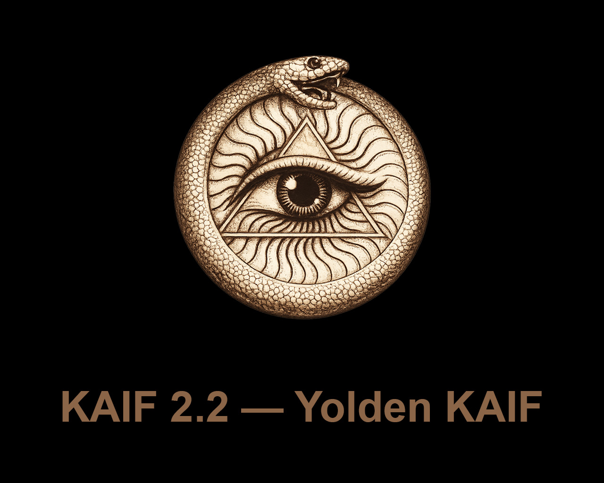

<p align="center">
  
</p>

<a id="english"></a>

# KAIF — Krinik AI Framework

<h3 align="center"><em>External memory and discipline for AI coding agents — in one self-deploying file.</em></h3>

<p align="center">
  <a href="#english"></a>
  &nbsp;
  <a href="#russian"></a>
</p>

[](LICENSE)
[](https://github.com/MikalaiKryvusha/KAIF/releases)
[](KAIF.md)
[](homeworks/02_DONE_field_test_thin_install_on_weak_llm.md)
[](#guardrails-en)
[](#lang-en)

<p align="center">
  <a href="#1-general">General</a> · <a href="#2-installation">Installation</a> · <a href="#3-the-deployed-framework">Deployed framework</a> · <a href="#4-the-skills">Skills</a> · <a href="#5-working-on-a-project">Working</a> · <a href="#6-updating-forking-removing">Updating</a> · <a href="#8-reference">Reference</a>
</p>

**KAIF — Krinik AI Framework — a context-resilient, fundamental strategic-operational methodological framework for AI agents: resilience to context loss and discipline of autonomy.**

This document is the user manual of the framework: it describes what KAIF is and how to use it.
The project's history lives in the [releases](https://github.com/MikalaiKryvusha/KAIF/releases)
and in section 8.1.

<p align="center">
  
</p>

<p align="center"><strong>Version 2.2 — Yolden KAIF</strong> · 2026-08-08</p>

> A very large-scale version, the one that endows KAIF with the power of an intelligent system that
> develops itself through a feedback loop. The ouroboros stands for the closing of the loop and for
> completeness. The eye stands for KAIF now being under the observation of the projects that use it —
> and those projects being under the observation of KAIF. Every cycle closes — the metaphorical ones
> and the technical ones alike.
>
> — *Mikalai Kryvusha, on the symbolism of the version*

<a id="excellent-en"></a>

## 1. General

### 1.1. Basic provisions

1. KAIF (Krinik AI Framework) is a methodological framework for AI agents: external memory and
   discipline for a project, packed into markdown files that the agent reads and maintains.
2. The framework is not code. It is a working process captured as files: key documents, directory
   conventions, and repeatable slash-skills. It works with any language, any stack, and any
   domain — programming, science, design, business.
3. The framework solves two chronic failures of AI agents. Context loss: without external memory,
   every new session re-discovers the architecture, the decisions, and the half-finished work.
   Drift: left autonomous, an agent either stalls or oversteps into decisions that are not its to
   make.
4. The human remains the visionary; the agent executes. Decisions that shape the product — brand,
   UX, architecture, naming — are made by the owner through interview documents; everything cheap
   to reverse is decided by the agent autonomously.
5. Nothing raw is trusted. Execution follows the fable loop, everything created carries a
   test-status marker (`[NOT-TESTED]` / `[TESTED: …]`), and an adversarial judge re-runs the
   claims before work counts as done.
6. The framework has a full lifecycle: deploy → update → fork → remove. Updates are mechanical and
   respect every local change (section 6).

<p align="center">
  <picture>
    <source media="(prefers-color-scheme: dark)" srcset="assets/knowledge-en-dark.svg">
    <source media="(prefers-color-scheme: light)" srcset="assets/knowledge-en-light.svg">
    
  </picture>
</p>

### 1.2. Terms

- **Deployment** — a project into which the framework has been unpacked; recorded in
  `.kaif/kaif.json`.
- **Owner** — the human whose project it is; the visionary. The owner fills `GOAL.md`, answers
  interviews, and gives verdicts on taste-class questions.
- **Agent** — the AI system working in the project (Claude or any other); the executor.
- **Skill** — a repeatable ritual the agent performs on command (`/resume`, `/release`, …); the
  verbs of project work. The full set is given in Table 3.
- **Sphere** — a domain library (programming, science, design, business) that adapts the
  framework's discipline to the domain's terminology, evidence rules, and fraud table.
- **Canon** — the binding documents of the deployment (Table 1); when canon and improvisation
  disagree, canon wins.

### 1.3. Boundaries of application

1. The framework is applied to cognitive projects driven by an AI agent under a human owner. It is
   not applied as a runtime library: nothing executes inside the target product.
2. Discipline is enforced by documents, rituals, and optional machine guards — not by the model's
   memory. A deployment where the agent does not read the canon before tasks receives no benefit.
3. The framework does not make the owner's decisions under any breadth of delegation: identity
   (names, slogans, brand strings) and taste verdicts remain human-only.

## 2. Installation

### 2.1. Basic provisions

1. The entry point is one file: **[`KAIF.md`](KAIF.md)** (10 KB). The agent reads it and executes
   three bootstrap steps with forced checkpoints; the file fetches the installer machinery from
   this repository, and the machinery deploys everything mechanically.
2. The machinery unpacks the documents, generates the skills for five agent systems at once,
   localizes the owner-facing documents, wires the auto-context pointers, validates itself against
   a sha256 manifest, and self-cleans. The agent's only cognitive work is the short
   `KAIF_ADAPTATION_TASK.md`: study the project, fill the maps, derive the plan.
3. The thin install replaces reading the full core: 10 KB (`KAIF.md`, 10 207 bytes) instead of
   339 KB (`KAIF-FULL.md`, 346 920 bytes) — ×34 less reading. Cognitive writing shrinks ×66
  .

<a id="tested-en"></a>

### 2.2. Installation procedure

1. Drop [`KAIF.md`](KAIF.md) into the project root.
2. Tell the agent:

   > *"Deploy KAIF from KAIF.md"*

   The agent needs a working Node.js and network access to this repository.
3. If the agent's harness asks to approve running the fetched installer — that is the
   download-and-execute pattern being flagged, as it should be; approve it once. The installer
   verifies every fetched artifact against `kaif-manifest.json` (sha256) before running.
4. Answer the adaptation questions the agent brings (project goal, sphere, language). Fill
   `GOAL.md` — the one document that is the owner's to write.
5. Any model strength works: the machinery does the structure, and every adaptation item carries a
   forced checkpoint command. The procedure is field-certified end-to-end on a local
   12-billion-parameter model (homework 02).

<sub>An installation is tracked to the origin by default — that is what makes version checks,
respectful updates and the field-report loop work out of the box. Deploying with no tie to the
origin at all: add `--mode anonymous` to the loader call. Such a deployment carries no origin
tracking and no author references (origin-tied skills are skipped, the author's note is stripped
mechanically, a final grep-gate refuses to finish while any identity leak remains) and it refuses
to update over the network. No update ever converts a deployment between the two modes.</sub>

### 2.3. Offline installation

Every release attaches **`KAIF-FULL.md`** — the classic self-contained core. It is unpacked
without network access and yields the same deployment; the thin path is preferred where the
network exists.

## 3. The deployed framework

### 3.1. Basic provisions

A deployment consists of four layers: commands (the skills the human invokes by name), state and
knowledge (living documents the agent maintains), rules of work (the canon), and machinery
(`.kaif/` — checksums, provenance-driven updates, spheres). The layers are shown in the diagram
below.

<p align="center">
  <picture>
    <source media="(prefers-color-scheme: dark)" srcset="assets/layers-en-dark.svg">
    <source media="(prefers-color-scheme: light)" srcset="assets/layers-en-light.svg">
    
  </picture>
</p>

### 3.2. The key documents

Fourteen key documents are deployed to the project root, and one more is optional — it appears only
where the owner's voice portrait was actually taken. Their purposes and maintainers are given in
Table 1.

Table 1 — Key documents of a deployment

| Document | What it is for | Who writes / maintains it |
|----------|----------------|---------------------------|
| `AGENT_GUIDE.md` | The canon: rules, router, checklist, conventions | Machinery deploys; agent adapts; the owner rarely touches it |
| `PHILOSOPHY.md` | How the agent thinks: KISS + Occam + the principle set | Universal — deployed verbatim |
| `BUG_FIXING_FRAMEWORK.md` | How the agent debugs: intent gate, fix→build→test, twin check | Universal — deployed verbatim |
| `TESTING_FRAMEWORK.md` | How the agent tests everything it creates: 7 principles + the `[NOT-TESTED]`/`[TESTED]` contract | Universal — deployed verbatim |
| `REQUIREMENTS_FRAMEWORK.md` | How the agent writes and checks requirements: goal vector + acceptance criteria first, ten quality criteria, the stop-word dictionary | Universal — deployed verbatim |
| `GOAL.md` | The vision: what the owner wants in the end | **The owner** — the one document that is theirs to fill |
| `STATUS.md` | The living summary of now (~200-line soft target) | Agent, after every significant task |
| `PROJECT_HISTORY.md` | The append-only chronicle of closed sessions, phases, releases | Agent moves entries at `/end-chat` |
| `EXPERIENCE.md` | The grep-friendly log of paid-for lessons | Agent grows it (`/experience`) |
| `MASTER_PLAN.md` | The phased roadmap from the current state to `GOAL.md` | Agent derives it (`/revision`) |
| `PROJECT_STRUCTURE_EXTERNAL_MAP.md` | The external map: directories, files, links | Agent maintains |
| `PROJECT_ARCHITECTURE_INTERNAL_MAP.md` | The internal map: abstractions and their interactions | Agent maintains |
| `KAIF_FRAMEWORK.md` | The deployment record: which KAIF is deployed here and how | Agent writes after injection |
| `KAIF_REFERENCE.md` (at `.kaif/`) | The complete framework reference; `/help-kaif` cites its sections | Deployed verbatim |
| `AUTHOR_STYLOMETRY.md` — **optional** | The portrait of the owner's written voice: registers, rules, an anti-portrait of AI markers, a self-check list. Text the owner signs is held to it | Taken by `/owner-voice` from the owner's own texts; the owner accepts it. A deployment without a portrait reddens no gate |

### 3.3. The knowledge directories

Seven knowledge directories are deployed, each with its own README. Their purposes are
given in Table 2. Closed items in `bugs/`, `ideas/`, `plans/`, and `homeworks/` receive the `DONE`
tag in the filename; the living references are never tagged.

Table 2 — Knowledge directories

| Directory | What accumulates there |
|-----------|------------------------|
| `plans/` | The agent's operational plans and epic ladders |
| `ideas/` | Feature proposals — mostly the owner's; implemented only after approval |
| `bugs/` | One document per defect, with forensics |
| `researches/` | Recon documents and answers to the big hard questions |
| `interviews/` | Owner-level decisions; the owner answers right in the document |
| `homeworks/` | Tasks only a human with a body can do, including taste-class artifacts |
| `reports/` | The agent's reports on cognitively heavy work; mandatory KAIF update/install field reports (`KAIF_UPDATES/`) and strong-model audit reports (`KAIF_AUDIT/`) |

### 3.4. The machinery

1. `.kaif/` holds the deployment marker (`kaif.json`), the machinery (`kaif-core.mjs`, backing the
   `npm run kaif:*` handles), the sphere libraries, and shipped templates (for example, the
   owner-voice portrait skeleton `_owner-voice-template.md`).
2. Every deployed file is classified by provenance: template shas record what the template looked
   like, disk shas record what the file looks like now. The update machinery (section 6) merges by
   this classification, module by module.
3. The update closes with `update-verify`: per-system skill copies are re-synced from the
   canonical `.claude/skills/`, placeholders are re-scanned, the deploy marker self-heals, and a
   receipt is written to `.kaif/last-update.json`.
4. `.kaif/hooks/` holds the optional **refresh-hooks** module for harnesses with lifecycle hooks:
   an order to re-read the canon after a context compaction, a timer on the age of the refresh
   marker, and a soft `STATUS.md` guard once per session. Activation is the owner's explicit
   opt-in — the machinery never edits somebody else's `settings.json`, and a deployment without
   hooks does not redden any gate.

## 4. The skills

### 4.1. Basic provisions

1. A skill is a repeatable ritual invoked by name (`/resume`) or by a natural-language trigger in
   the owner's language («сделай релиз», «haz un release», …). Trigger aliases in ten languages
   are appended at deploy time; the skill bodies stay English.
2. Skills are generated for five agent systems at once — Claude Code, Codex, Grok Build, Cline,
   Zoo Code — plus the universal `AGENTS.md`; the canonical copies live in `.claude/skills/`.
3. Thirty-five skills are deployed.

Table 3 — The skills

| Skill | Purpose |
|-------|---------|
| `/resume` | Start a session: read the canon docs, pick the one main thing, announce it, begin. |
| `/kaif-go` | The slash-command form of saying "carry on" (short alias `/go`): continue the work in the current chat. It is never a blanket yes to vision forks, the write-gate or an `AUTH:` line. |
| `/pause` | Soft-park the chat: reach a logical stopping point, keep the tree green, continue HERE later — no pushes, no ceremony. |
| `/end-chat` | Fully close the chat: update `STATUS.md`, rebuild artifacts, commit AND push, hand the baton to other chats. |
| `/autoloop` | A long autonomous series over the backlog; every item ends with a mandatory judge pass. |
| `/dayloop` | Daytime autonomous work while the owner is busy — with brief progress pings in chat. |
| `/nightloop` | Autonomous work until morning; the morning report leads with outcomes. |
| `/guarded-loop` | An autonomous loop under a watchdog: external wake-ups every N minutes, a heartbeat file proving real progress, a restart policy with an escalation cap. |
| `/refresh-context` | Re-read the master plan, the maps and the open backlog mid-marathon — rebuild the big picture. |
| `/check-backlog` | Audit `bugs/` + `ideas/` + `plans/`: list what is open, tag the finished `DONE`. |
| `/experience` | Capture a lesson into `EXPERIENCE.md` — or recall lessons by tags before a task. |
| `/report-bug` | File a defect document in `bugs/` by the canon — one file per bug. |
| `/bug-research` | Deep investigation without code edits — mandatory after 3 failed blind fixes. |
| `/propose-idea` | Propose a feature as an `ideas/` document — implemented only after the owner's approval. |
| `/interview` | Ask the owner the fateful A/B/C/D questions — vision decisions are never guessed. |
| `/owner-voice` | A stylometric portrait of the owner's written voice, taken from their own texts into the optional `AUTHOR_STYLOMETRY.md`; AI text in the owner's artifacts is then written or re-voiced to sound like the owner, under machine-checkable invariants. |
| `/owner-reviews` | The optional review contour: interviews and outbound drafts rendered as local HTML pages, decisions recorded with author and time, sends mechanically gated by approval — fail-closed. |
| `/fix-vision` | Capture the owner's vision-level chat messages into the docs before they evaporate. |
| `/what-next` | Rank the next steps by value toward the vision when the owner asks "what now?". |
| `/plan-task` | Plan an ordinary task/bug/idea into ONE operational plan; heavy tasks are handed to `/plan-epic`. |
| `/plan-epic` | Plan a heavy epic by the full ladder: industry web-recon + local recon → research doc → meta-plan with phases → operational plan of the NEXT phase only. |
| `/revision` | Re-derive `MASTER_PLAN.md` from `GOAL.md` and the current state. |
| `/derive-styleguide` | Derive the owner's style guide from THEIR OWN sample — approved once, then machine-lintable rules guard it. |
| `/code-revision` | A periodic reading revision of the codebase by the strongest model: parallel reviewers armed with the project's own paid-for failure classes; every finding needs a verbatim quote and survives an adversarial skeptic — or dies. The run leaves audit reports in `reports/KAIF_AUDIT/`, grouped by finding family, each finding a contract a weaker model can execute. |
| **`/fable-method`** | The execution loop: classify → define done → evidence → act → verify → report. *(vendored from [fable-method](https://github.com/Sahir619/fable-method), MIT)* |
| **`/fable-loop`** | Orchestrated run: parallel evidence, surgical execution, adversarial verifiers. |
| **`/fable-judge`** | Adversarial verification of any "done" claim: VERIFIED / CAVEATS / REFUTED. |
| **`/fable-domain`** | Generate a trusted domain-workflow bundle (adapter + trap + smoke eval). |
| `/help-kaif` | Explain KAIF to the owner in chat — a structured user manual. |
| `/release` | Publish a release (with the owner's confirmation and a mandatory judge pass; never autonomously). |
| `/kaif-version` | Report the deployed KAIF version and check origin for a newer release. |
| `/kaif-update` | Mechanical respectful update from origin — content snapshots protect local customizations. |
| `/kaif-fork` | Snapshot the evolved KAIF into the owner's own repository and track their own line. |
| `/kaif-switch-origin` | Switch tracking from a fork back to the official origin. |
| `/kaif-remove` | Respectful removal — asks partial (knowledge artifacts stay) vs full. |

## 5. Working on a project

### 5.1. The session cycle

A session begins with `/resume` (the agent reads the canon and picks the one main thing), proceeds
through the work with verification, and ends with `/pause` (soft-park) or `/end-chat` (full
closure with a handoff). The state carries over in the files, not in the chat: the next session
starts from an empty context and is productive immediately.

<p align="center">
  <picture>
    <source media="(prefers-color-scheme: dark)" srcset="assets/session-en-dark.svg">
    <source media="(prefers-color-scheme: light)" srcset="assets/session-en-light.svg">
    
  </picture>
</p>

### 5.2. Roles and interviews

1. The owner is the visionary: fills `GOAL.md`, drops ideas into `ideas/`, answers interviews,
   gives taste verdicts. The agent is the executor: everything else.
2. Everything the agent wants FROM the owner — a fork, a review, an approval, an answer — lives
   only in `interviews/`; questions are closed A/B/C/D with the recommendation first, and the
   owner answers right in the document. An answer given on a rendered page, in the document, or in
   chat carries equal force and is recorded with author and time.
3. The owner's written voice is reproducible: `/owner-voice` takes a stylometric portrait from the
   owner's own texts into `AUTHOR_STYLOMETRY.md` (an optional canon file in the project root), and
   AI text in the owner's artifacts is then held to it.

### 5.3. Autonomy loops

If the owner is away, the agent grinds the backlog autonomously: `/dayloop` (with progress pings),
`/nightloop` (morning report), `/autoloop` (a long series), or `/guarded-loop` (under an external
watchdog with a heartbeat file — a hung chat cannot silently kill the run). Every item ends with a
mandatory judge pass; an owner's drive-by note is filed to the backlog, not a task switch.

### 5.4. Execution discipline

Any non-trivial task runs the fable loop: classify the ask → define done → gather evidence →
decide → act surgically → verify by observation → report outcome-first, with forced artifacts at
decision points. When work is declared complete — the agent's own or anyone else's — `/fable-judge`
re-runs the claims adversarially before the work counts as done.

<a id="guardrails-en"></a>

### 5.5. Guardrails and provenance

1. Observation beats conjecture: claims trace to sources, and a gap in the canon opens exactly
   three doors — find it in an existing source of truth, ask the owner, and inventing is
   forbidden.
2. AI-written text in the owner's canon artifacts carries provenance marks `[AI]…[/AI]`; only the
   owner's word removes a mark. Optional machine tools (the provenance gate, the canon linter)
   ship as modules and are wired on request.
3. A guard of a text rule runs at ~10 false hits per real one; exceptions are explicit, with the
   reason on the line. A false `[TESTED]` marker is fraud for the judge.

### 5.6. Fresh context

1. Rules read once at the start of a session melt as the context fills and is compacted: a long
   session holds a retelling of the canon. So the re-reading core is re-read on four triggers — an hour of live work, the start of a heavy task, a compaction
   or a long pause, and the ritual points (`/resume`, `/refresh-context`, every iteration of the
   loops).
2. A refresh is a verifiable act. Its witness has two halves and both are required:
   the marker `.kaif/refresh-marker.json` (the moment, what was re-read, which trigger) and an
   acceptance quote in the chat — one concrete line out of what was re-read, relevant to the task
   in hand. A marker without a quote is fraud of the same class as a false `[TESTED]`.
3. The agent learns its own machine from its own probes: the environment
   dossier in `AGENT_GUIDE.md` records what the shells, the toolchain and the encodings actually
   are, keeps the probe command next to every fact, and declares facts older than four weeks to be
   hypotheses again.

## 6. Updating, forking, removing

### 6.1. Basic provisions

1. Updates are mechanical and respectful: `npm run kaif:update` (or
   `node .kaif/kaif-core.mjs update`) fetches the latest machinery and classifies every framework
   file by provenance. A file never touched locally refreshes wholesale; a file adapted or
   localized goes through the module-by-module merge — local modules stay local, untouched
   upstream modules take the new template text silently, and a module lands in the short
   `KAIF_UPDATE_TASK.md` (with a ready diff) only where upstream actually changed under local
   edits.
2. The owner's content — `GOAL.md`, `STATUS.md`, the knowledge directories — is never in scope.
3. The update closes with the same guarantees as a fresh install (section 3.4) and leaves a
   receipt in `.kaif/last-update.json`.

### 6.2. The handles

The mechanical handles installed into `package.json` are given in Table 4. Forking, switching
origin, and removal are driven by their skills — ask the agent.

Table 4 — The `npm run kaif:*` handles

| Command | What it does |
|---------|--------------|
| `npm run kaif:version` | Show the deployed KAIF version (from `.kaif/kaif.json`). |
| `npm run kaif:check` | Validate the deployment against its manifest — works even after self-clean. |
| `npm run kaif:update` | Mechanical respectful update from origin (section 6.1). |

### 6.3. Updating old deployments

A pre-1.5 project updates by dropping the fresh thin `KAIF.md` on top and asking for an update:
the installer detects the existing deployment and adopts everything it finds as local.
Field-tested on a real 1.4 project — the owner's content survived byte-for-byte
([homework 03](homeworks/03_DONE_field_test_update_real_14_project.md)).

## 7. Spheres, agent systems, languages

### 7.1. Spheres

A sphere ships to `.kaif/spheres/` with the domain's terminology and its execution discipline: the
binding minimum evidence set, the authority order, what "verified by observation" means there, the
fraud table the judge hunts by, and the domain's craft recipes. Prebuilt spheres: programming ·
science · design · business; a new sphere is authored at deploy time from the shipped template.

### 7.2. Agent systems

Skills are generated for five systems at once: Claude Code (`.claude/skills/`, canonical) · Codex
(`.agents/skills/`) · Grok Build (`.grok/skills/`) · Cline (`.cline/skills/`) · Zoo Code
(`.roo/commands/`) — plus the universal `AGENTS.md`; Cursor/Copilot/Windsurf ride the fallback.
The refresh-hooks module carries sample hook configurations only for the harnesses whose hook
contract was read off live vendor documentation — Codex, Cursor, Copilot, Antigravity; Grok Build
matches the Claude Code contract and needs no sample of its own. Where a vendor has no hook
mechanism, the module says so in one line instead of guessing a path.

<a id="lang-en"></a>

### 7.3. Languages

The framework's sources are English. On deploy the machinery localizes the owner-facing documents
(`GOAL.md`, `KAIF_FRAMEWORK.md`, the directory READMEs) from prebuilt packs — ten languages: en,
ru, zh-Hans, es, hi, ar, pt, fr, de, ja — and appends trigger aliases in the owner's language to
every skill. Agent-internal documents stay English by design. Other languages degrade honestly:
English plus a translation item in the adaptation task.

## 8. Reference

### 8.1. Milestones

The history in one table; each codename is a discipline the framework learned. Full notes (from
1.1 on) live in the [releases](https://github.com/MikalaiKryvusha/KAIF/releases).

Table 5 — Versions

| Version | Codename | Date | The discipline learned |
|---------|----------|------|------------------------|
| v1.0 | — | 2026-06-30 | The distillation: the working method extracted into one self-extracting core; the repository wrapped by its own framework from day one. |
| v1.1 | Structured KAIF | 2026-07-01 | `x.y` versioning, the key-document set (vision, plan, two maps), the knowledge directories. |
| v1.2 | Anonymous KAIF | 2026-07-03 | The mechanical unpacker, the anonymous install mode, skill translation for non-Claude systems. |
| v1.3 | Slim KAIF | 2026-07-06 | A one-file lightweight variant (retired in 1.5 in favor of the thin core + offline `KAIF-FULL.md`). |
| v1.4 | Savvied KAIF | 2026-07-08 | `EXPERIENCE.md` — the grep-friendly journal of lessons; lazy context loading; optional hook enforcement. |
| v1.5 | Tested KAIF | 2026-07-17 | The thin install, five agent systems and ten languages at once, mechanical respectful updates, `TESTING_FRAMEWORK.md`, the vendored fable loop; field-certified on a 12 B local model. |
| v1.6 | Homeostatic KAIF | 2026-07-24 | Guardrails for weak models: observation over conjecture, the three doors, the judge before every push, provenance marks `[AI]…[/AI]`. |
| v2.0 | Excellent KAIF | 2026-07-28 | Updates by machinery, not by mind: the module map, template-vs-disk shas, update receipts, the `KAIF_REFERENCE.md` reference, the permanent sandbox polygon. |
| v2.1 | Strong KAIF | 2026-07-31 | The owner contour: the place-of-questions rule with `/owner-reviews`, the owner's voice portrait `/owner-voice`, craft prostheses for weak sessions (`/code-revision`, craft slots, `/guarded-loop`), the planning ladder, the `PROJECT_HISTORY.md` chronicle. |
| v2.2 | Yolden KAIF | 2026-08-08 | The loop closes: the interactive contour turns a question to the owner into a working channel, the field-to-origin signal path gained five prescribed steps, `REQUIREMENTS_FRAMEWORK.md` joins as the 14th key document, re-reading the canon becomes a verifiable act with a witness marker and the optional `refresh-hooks` module, and `/kaif-go` is the slash-command form of saying "carry on": a simple way to continue the work in the current chat. |

### 8.2. Repository layout

```
KAIF.md                               ⭐ the THIN entry point (bootstrap + embedded loader), generated
KAIF_REFERENCE.md                     the complete framework reference (generated from framework/KAIF_REFERENCE.md)
README.md                             this manual (EN+RU)
README.pdf                            its rendered copy
LICENSE                               MIT
KAIF.jpg                              the logo
framework/                            the canonical universal templates (the payload)
  _intro.md                           the narrative of the full core
  installer/                          KAIF-CORE.mjs (the machinery) · KAIF-LOADER.mjs · the thin core's narrative
  skills/                             35 skill templates (one directory per skill)
  spheres/                            sphere libraries: programming · science · design · business · _template · _index
  adapters/                           10 agent-system adapters (five skill-target systems + fallback and archived ones)
  templates/_owner-voice-template.md  the owner-voice portrait skeleton (ships to .kaif/)
  templates/languages/                9 language packs (owner-facing docs + skill trigger aliases; English is the source)
  tools/                              optional tool modules: provenance gate · canon linter · requirements linter
  hooks/                              the optional refresh-hooks module (3 scripts + sample configs → .kaif/hooks/)
  readmes/                            7 directory READMEs
  AGENT_GUIDE.md … KAIF_REFERENCE.md  the fourteen key-document templates
dist/                                 generated distribution (never hand-edited)
  KAIF.md                             the thin entry point
  KAIF-CORE.mjs                       the installer machinery
  KAIF-CORE-BUNDLE.md                 the payload bundle (file blocks)
  kaif-manifest.json                  sha256 manifest
  KAIF-FULL.md                        the offline self-contained core
  kaif-module-map.json                the module map (headings → modules)
assets/                               generated README diagrams (3 × light/dark × EN/RU)
tools/                                build-framework.mjs · check-framework.mjs · sandbox-suite.mjs (the polygon)
                                      · module-map-lib.mjs · build-diagrams.mjs · readme-pdf.mjs · commit.mjs · kaif.mjs
AGENT_GUIDE.md · STATUS.md · …        the dogfooding wrapper: the framework applied to itself
plans/ ideas/ bugs/ researches/       the wrapper's knowledge directories
interviews/ homeworks/ reports/       (each with its own README)
```

### 8.3. This repository is fractal

This repository is the framework and is wrapped by the framework — it uses itself. The root holds
a real `AGENT_GUIDE.md`, `STATUS.md`, `.claude/skills/`, and knowledge directories describing the
development of the framework itself. A deployment into another project starts from `KAIF.md`
only — never from this repository's wrapper files. Everything a deployment needs is fetched from
`dist/`, which is generated from `framework/` by `node tools/build-framework.mjs`; generated
artifacts are never hand-edited.

### 8.4. Limitations of the current version

1. Localization covers the owner-facing documents and skill trigger aliases (ten languages); the
   canon and skill bodies are English by design.
2. Native skills are generated for five agent systems; other harnesses (Cursor, Copilot,
   Windsurf) ride the universal `AGENTS.md` fallback without native skill files.
3. The sandbox polygon (14 suites) verifies the deploy/update machinery; the methodology itself is
   verified by field reports, not by the polygon.
4. Discipline is enforced by documents and rituals; without the optional tool modules and hooks
   there is no runtime enforcement — an agent that skips `/resume` works without the canon.
5. The manual counts 14 documents + 7 READMEs + 35 skills + 1 unpacker = 57 embedded files;
   161 bundle blocks; 689 modules.

### 8.5. Interesting facts

#### 8.5.1. Metrics of the work on KAIF 2.2

Measured at **2026-08-09 00:46 +03:00** by `node tools/kaif-stats.mjs --since
"2026-08-07T00:00:00+03:00"`. The window is two days: from 2026-08-07 at 00:00 +03:00 to the moment of
the measurement.

Table 6 — Metrics of KAIF 2.2

| What was measured | Value | What it equals |
|-------------------|-------|----------------|
| Time spent on the version | **2.0 days** | the whole version was built on 7 and 8 August 2026 |
| Active working time of the human + AI-agent pair | **29.0 hours** | about 3.6 full 8-hour working days |
| Commits in git | 141 | about 5 commits per hour of active work |
| Files touched | 416 | — |
| Files created from nothing | 190 | — |
| Lines added | +44 893 | — |
| Lines removed | −1 774 | 25 times more added than removed |
| Prose written by hand | 28 284 lines | — |
| Words of prose written by hand | **316 764** | about **3.9 novels** of 80 000 words |
| Code written by hand | 10 067 lines | — |
| Writing pace | 10 936 words per hour of active work | a human writes that many in 87 hours |
| Tokens spent by the models in total | **3 011 949 062** | about **17 919 novels** read and written again |
| Of those, written by the models themselves | 14 368 418 tokens | about **87 novels** |
| Requests made by Fable 5 | 4 729 | it spent 50 % of the owner's weekly limit — that model's personal limit burnt out completely |
| Requests made by Opus 5 | 4 945 | it spent 20 % of the owner's weekly limit |
| Requests to the models in total | 9 676 | about 322 requests per session |
| Chat sessions | 29 | — |
| Plans written | 62 | — |
| Bugs filed | 63 | 58 of them closed |
| Ideas proposed | 24 | — |
| Research documents produced | 19 | — |
| Owner interviews | 17 | — |
| Reports written | 13 | — |
| Files in the knowledge directories in total | **228** | counting the directory READMEs and the reports in nested folders |
| Characters in those documents | **2 149 895** | — |
| Words in those documents | **299 632** | about **3.7 novels** of 80 000 words worth of accompanying documentation, and the next session of the agent reads every page |
| Owner decisions recorded | 65 | — |
| Experience lessons written | 71 | — |
| Skills in the delivery | 35 | — |
| What Fable 5's work would cost if paid at Anthropic's public API prices | $2 429 | — |
| What Opus 5's work would cost if paid at Anthropic's public API prices | $1 079 | this money was NOT paid |
| What all the work would cost if paid at Anthropic's public API prices | **$3 509** | about **594 hamburgers** at $5.91 — or 1.1 monthly salaries of a software engineer |
| **Paid by subscription** | **≈ $16.89** | the share of a Claude Max subscription ($250 per month) that falls on two days of work |
| How many times API prices exceed that subscription share | **208 times** | — |
| If living people had written KAIF 2.2, their work would have amounted to | **5 517 person-hours** | a team of **five engineers working 138 days straight**. The rates are industry ones: 125 words per hour for technical prose, 27 lines of code per working day |
| Payroll for those people | **$98 517** | at an engineer's salary of $3 000 per month |
| Electricity spent on the computation | **≈ 18.1 kWh** | an ordinary flat spends that much in **1.8 days**. The rate is 0.0003 Wh per token — the median measurement of GPT-4o |
| How much human work falls on one hour of the pair's work | **190 person-hours** | one hour of a human working with the agent does what a human alone would do in 190 hours |

Active work means the hours when work was actually happening: sleep and long pauses do not count.

## License

[MIT](LICENSE) — © 2026 **Mikalai Kryvusha** aka **KOT KRINIK** · Николай Кривуша aka Кот Криник.
The execution-discipline skills (`fable-*`) are vendored from
[fable-method](https://github.com/Sahir619/fable-method) © Sahir619, MIT.

Use it, copy it, modify it, ship it — including, as this repository shows, on the framework's own
project. Thank you, and pleasant work!

---
---

<a id="russian"></a>

# KAIF — Krinik AI Framework

<h3 align="center"><em>Внешняя память и дисциплина для ИИ-агентов — в одном самораскрывающемся файле.</em></h3>

<p align="center">
  <a href="#english"></a>
  &nbsp;
  <a href="#russian"></a>
</p>

[](LICENSE)
[](https://github.com/MikalaiKryvusha/KAIF/releases)
[](KAIF.md)
[](homeworks/02_DONE_field_test_thin_install_on_weak_llm.md)
[](#guardrails-ru)
[](#lang-ru)

<p align="center">
  <a href="#1-общие-сведения">Общие сведения</a> · <a href="#2-установка">Установка</a> · <a href="#3-устройство-развёрнутого-фреймворка">Устройство</a> · <a href="#4-навыки">Навыки</a> · <a href="#5-работа-над-проектом">Работа</a> · <a href="#6-обновление-форк-удаление">Обновление</a> · <a href="#8-справочные-сведения">Справка</a>
</p>

**КАИФ — Криник АИ Фреймворк — контекстоустойчивый фундаментальный стратегическо-операционный методологический фреймворк для ИИ-агентов: устойчивость к потере контекста и дисциплина автономности.**

Настоящий документ является руководством пользователя фреймворка: он описывает, чем KAIF является
и как им пользоваться. История проекта живёт в
[релизах](https://github.com/MikalaiKryvusha/KAIF/releases) и в разделе 8.1.

<p align="center">
  
</p>

<p align="center"><strong>Версия 2.2 — Yolden KAIF</strong> · 2026-08-08</p>

> Очень масштабная версия, наделяющая KAIF силой умной системы, самостоятельно развивающейся по
> циклу обратной связи. Уроборос символизирует замыкание цикла и совершенство. Глаз символизирует
> то, что KAIF теперь под наблюдением проектов, которые им пользуются, а проекты, которые им
> пользуются, — под наблюдением KAIF. Все циклы — и метафорические, и технические — замыкаются.
>
> — *Николай Кривуша, о символике версии*

<a id="excellent-ru"></a>

## 1. Общие сведения

### 1.1. Основные положения

1. KAIF (Krinik AI Framework) является методологическим фреймворком для ИИ-агентов: внешняя память
   и дисциплина проекта, упакованные в markdown-файлы, которые агент читает и ведёт.
2. Фреймворк не является кодом. Фреймворк является рабочим процессом, зафиксированным файлами:
   ключевые документы, конвенции директорий и повторяемые навыки. Фреймворк применяется с любым
   языком, любым стеком и в любой сфере — программирование, наука, дизайн, бизнес.
3. Фреймворк устраняет два хронических отказа ИИ-агентов. Потеря контекста: без внешней памяти
   каждая новая сессия заново открывает архитектуру, решения и недоделанную работу. Дрейф:
   оставленный автономным, агент либо буксует, либо принимает решения, которые принимать не
   вправе.
4. Человек остаётся визионером; агент исполняет. Решения, формирующие продукт, — бренд, UX,
   архитектура, нейминг — принимаются владельцем через документы интервью; всё, что дёшево
   откатить, агент решает автономно.
5. Сырому доверия нет. Исполнение ведётся по fable-циклу, всё созданное несёт маркер тест-статуса
   (`[NOT-TESTED]` / `[TESTED: …]`), и состязательный судья перепроверяет заявления прежде, чем
   работа считается сделанной.
6. Фреймворк обладает полным жизненным циклом: развёртывание → обновление → форк → удаление.
   Обновление выполняется механически и уважает каждую локальную правку (раздел 6).

<p align="center">
  <picture>
    <source media="(prefers-color-scheme: dark)" srcset="assets/knowledge-ru-dark.svg">
    <source media="(prefers-color-scheme: light)" srcset="assets/knowledge-ru-light.svg">
    
  </picture>
</p>

### 1.2. Термины

- **Развёртывание** — проект, в который распакован фреймворк; фиксируется в `.kaif/kaif.json`.
- **Владелец** — человек, которому принадлежит проект; визионер. Владелец заполняет `GOAL.md`,
  отвечает на интервью и выносит вердикты по вопросам класса «вкус».
- **Агент** — ИИ-система, работающая в проекте (Claude или любая другая); исполнитель.
- **Навык** — повторяемый ритуал, выполняемый агентом по команде (`/resume`, `/release`, …);
  глаголы работы над проектом. Полный набор приведён в Таблице 3.
- **Сфера** — библиотека предметной области (программирование, наука, дизайн, бизнес),
  адаптирующая дисциплину фреймворка к терминологии, правилам свидетельств и таблице фродов
  домена.
- **Канон** — обязывающие документы развёртывания (Таблица 1); при расхождении канона и
  импровизации побеждает канон.

### 1.3. Границы применения

1. Фреймворк применяется к когнитивным проектам, которые ведёт ИИ-агент под человеком-владельцем.
   Фреймворк не применяется как runtime-библиотека: внутри целевого продукта ничего не
   исполняется.
2. Дисциплина держится на документах, ритуалах и опциональных машинных стражах — не на памяти
   модели. Развёртывание, в котором агент не читает канон перед задачами, пользы не получает.
3. Фреймворк не принимает решений владельца ни при какой широте делегирования: идентичность
   (имена, слоганы, брендовые строки) и вкусовые вердикты остаются только за человеком.

## 2. Установка

### 2.1. Основные положения

1. Точкой входа является один файл: **[`KAIF.md`](KAIF.md)** (10 КБ). Агент читает его и выполняет
   три шага бутстрапа с принудительными чекпоинтами; файл получает установочную машинерию из
   настоящего репозитория, и машинерия развёртывает всё механически.
2. Машинерия распаковывает документы, генерирует навыки сразу для пяти агентских систем,
   локализует документы владельца, подключает указатели автоконтекста, сверяет себя по
   sha256-манифесту и самоочищается. Единственная когнитивная работа агента — короткое задание
   `KAIF_ADAPTATION_TASK.md`: изучить проект, заполнить карты, вывести план.
3. Тонкая установка заменяет чтение полного ядра: 10 КБ (`KAIF.md`, 10 207 байт) вместо 339 КБ
   (`KAIF-FULL.md`, 346 920 байт) — чтения меньше в 34 раза. Когнитивное письмо сокращается в
   66 раз.

<a id="tested-ru"></a>

### 2.2. Порядок установки

1. Файл [`KAIF.md`](KAIF.md) помещается в корень проекта.
2. Агенту говорится:

   > *«Разверни KAIF из KAIF.md»*

   Агенту требуются рабочий Node.js и сетевой доступ к настоящему репозиторию.
3. Если харнесс агента просит одобрить запуск полученного установщика — это штатное срабатывание
   на паттерн «скачай и исполни»; одобряется один раз. Установщик сверяет каждый полученный
   артефакт по `kaif-manifest.json` (sha256) до запуска.
4. Владельцем даются ответы на вопросы адаптации (цель проекта, сфера, язык) и заполняется
   `GOAL.md` — единственный документ, который пишет владелец.
5. Сила модели значения не имеет: структуру делает машинерия, и каждый пункт адаптации несёт
   принудительную чекпоинт-команду. Порядок сертифицирован в поле насквозь на локальной модели в
   12 миллиардов параметров (домашка 02).

<sub>Установка по умолчанию привязана к origin — именно этим работают проверка версии, уважительные
обновления и петля полевых отчётов. Развернуть вообще без привязки к origin: добавьте
`--mode anonymous` к вызову загрузчика. Такое развёртывание не несёт ни трекинга origin, ни
упоминаний автора (привязанные к origin навыки пропускаются, записка автора вырезается механически,
финальный греп-гейт не даёт завершиться, пока остаётся утечка идентичности) и отказывается
обновляться по сети. Обновление никогда не переводит развёртывание из режима в режим.</sub>

### 2.3. Офлайн-установка

К каждому релизу прикладывается **`KAIF-FULL.md`** — классическое самодостаточное ядро. Оно
распаковывается без сети и даёт то же развёртывание; при наличии сети предпочтителен тонкий путь.

## 3. Устройство развёрнутого фреймворка

### 3.1. Основные положения

Развёртывание состоит из четырёх слоёв: команды (навыки, вызываемые человеком по имени),
состояние и знание (живые документы, которые ведёт агент), правила работы (канон) и механика
(`.kaif/` — контрольные суммы, обновление по происхождению, сферы). Слои показаны на схеме ниже;
слои показаны на схеме ниже.

<p align="center">
  <picture>
    <source media="(prefers-color-scheme: dark)" srcset="assets/layers-ru-dark.svg">
    <source media="(prefers-color-scheme: light)" srcset="assets/layers-ru-light.svg">
    
  </picture>
</p>

### 3.2. Ключевые документы

В корень проекта разворачиваются четырнадцать ключевых документов, и ещё один является
опциональным — он появляется только там, где портрет голоса владельца действительно снят. Их
назначение и ведущие приведены
в Таблице 1.

Таблица 1 — Ключевые документы развёртывания

| Документ | Для чего | Кто пишет / ведёт |
|----------|----------|-------------------|
| `AGENT_GUIDE.md` | Канон: правила, роутер, чек-лист, конвенции | Разворачивает машинерия; агент адаптирует; владелец почти не трогает |
| `PHILOSOPHY.md` | Как агент мыслит: KISS + Оккам + набор принципов | Универсален — разворачивается дословно |
| `BUG_FIXING_FRAMEWORK.md` | Как агент отлаживает: гейт намерения, fix→build→test, поиск близнецов | Универсален — разворачивается дословно |
| `TESTING_FRAMEWORK.md` | Как агент тестирует всё созданное: 7 принципов + контракт `[NOT-TESTED]`/`[TESTED]` | Универсален — разворачивается дословно |
| `REQUIREMENTS_FRAMEWORK.md` | Как агент пишет и проверяет требования: вектор цели + критерии приёмки первыми, десять критериев качества, стоп-словарь | Универсален — разворачивается дословно |
| `GOAL.md` | Видение: чего владелец хочет в итоге | **Владелец** — единственный документ, который заполняет он |
| `STATUS.md` | Живая сводка текущего положения (мягкий ориентир ~200 строк) | Агент, после каждой значимой задачи |
| `PROJECT_HISTORY.md` | Дописываемая летопись закрытых сессий, фаз, релизов | Агент переносит записи на `/end-chat` |
| `EXPERIENCE.md` | Греп-дружелюбный журнал оплаченных уроков | Агент растит сам (`/experience`) |
| `MASTER_PLAN.md` | Фазовый план от текущего состояния к `GOAL.md` | Агент выводит (`/revision`) |
| `PROJECT_STRUCTURE_EXTERNAL_MAP.md` | Внешняя карта: директории, файлы, связи | Ведёт агент |
| `PROJECT_ARCHITECTURE_INTERNAL_MAP.md` | Внутренняя карта: абстракции и их взаимодействия | Ведёт агент |
| `KAIF_FRAMEWORK.md` | Запись о развёртывании: какой KAIF здесь развёрнут и как | Агент пишет после инъекции |
| `KAIF_REFERENCE.md` (в `.kaif/`) | Полная пояснительная записка фреймворка; `/help-kaif` цитирует её разделы | Разворачивается дословно |
| `AUTHOR_STYLOMETRY.md` — **опциональный** | Портрет письменного голоса владельца: регистры, правила, анти-портрет ИИ-маркеров, чек-лист самопроверки. Текст, который владелец подписывает, держится по нему | Снимает `/owner-voice` с собственных текстов владельца; принимает владелец. Развёртывание без портрета не краснит ни один гейт |

### 3.3. Директории знаний

Разворачиваются шесть директорий знаний, каждая со своим локализованным README. Их назначение
приведено в Таблице 2 (директорий — семь). Закрытые единицы в `bugs/`, `ideas/`, `plans/` и `homeworks/` получают тег
`DONE` в имени файла; живые справочники тегом не помечаются.

Таблица 2 — Директории знаний

| Директория | Что в ней накапливается |
|------------|-------------------------|
| `plans/` | Операционные планы агента и лестницы эпиков |
| `ideas/` | Предложения фич — в основном владельца; реализуются только после одобрения |
| `bugs/` | По документу на дефект, с форензикой |
| `researches/` | Разведдоки и ответы на большие трудные вопросы |
| `interviews/` | Решения уровня владельца; владелец отвечает прямо в документе |
| `homeworks/` | Задачи, которые может выполнить только человек с телом, включая артефакты класса «вкус» |
| `reports/` | Отчёты агента о когнитивно ёмкой работе; обязательные полевые отчёты об обновлении/установке KAIF (`KAIF_UPDATES/`) и аудит-отчёты сильных моделей (`KAIF_AUDIT/`) |

### 3.4. Механика

1. В `.kaif/` находятся маркер развёртывания (`kaif.json`), машинерия (`kaif-core.mjs`, на которой
   держатся ручки `npm run kaif:*`), библиотеки сфер и поставляемые шаблоны (например, скелет
   портрета голоса владельца `_owner-voice-template.md`).
2. Каждый развёрнутый файл классифицируется по происхождению: template-sha фиксирует, каким был
   шаблон, disk-sha — каким файл является сейчас. Машинерия обновления (раздел 6) сливает по этой
   классификации, помодульно.
3. Обновление завершается проверкой `update-verify`: посистемные копии навыков ресинкаются с
   канонических `.claude/skills/`, плейсхолдеры пересканируются, маркер развёртывания
   самовосстанавливается, и рядом остаётся расписка `.kaif/last-update.json`.
4. В `.kaif/hooks/` лежит опциональный модуль **refresh-hooks** для харнессов с lifecycle-хуками:
   приказ перечитать канон после сжатия контекста, таймер возраста маркера освежения и мягкий страж
   `STATUS.md` раз в сессию. Подключение — явный опт-ин владельца: машинерия не редактирует чужие
   `settings.json`, а развёртывание без хуков не краснит ни один гейт.

## 4. Навыки

### 4.1. Основные положения

1. Навык вызывается по имени (`/resume`) или естественной фразой на языке владельца («сделай
   релиз», «haz un release», …). Алиасы-триггеры на десяти языках дописываются при развёртывании;
   тела навыков остаются английскими.
2. Навыки генерируются сразу для пяти агентских систем — Claude Code, Codex, Grok Build, Cline,
   Zoo Code — плюс универсальный `AGENTS.md`; канонические копии живут в `.claude/skills/`.
3. Разворачиваются тридцать пять навыков. Каждому отведена своя строка Таблицы 3.

Таблица 3 — Навыки

| Навык | Назначение |
|-------|------------|
| `/resume` | Начать сессию: прочитать канон-документы, выбрать одно главное, объявить и приступить. |
| `/kaif-go` | Слеш-команда «продолжай» (короткий алиас `/go`): продолжить работу в текущем чате. Никогда не бланковое «да» на развилки видения, write-gate и строки `AUTH:`. |
| `/pause` | Мягко припарковать чат: дойти до логической точки, оставить дерево зелёным, продолжить ЗДЕСЬ позже — без пушей и церемоний. |
| `/end-chat` | Полностью закрыть чат: обновить `STATUS.md`, пересобрать артефакты, закоммитить И запушить, передать эстафету другим чатам. |
| `/autoloop` | Длинная автономная серия по беклогу; каждый пункт завершается обязательным judge-проходом. |
| `/dayloop` | Дневная автономная работа, пока владелец занят, — с короткими сводками в чат. |
| `/nightloop` | Автономная работа до утра; утренний отчёт — результатом вперёд. |
| `/guarded-loop` | Автономный цикл под сторожем: внешние пробуждения каждые N минут, heartbeat-файл реального прогресса, политика рестартов с потолком эскалации. |
| `/refresh-context` | Перечитать мастер-план, карты и открытый беклог посреди марафона — восстановить картину. |
| `/check-backlog` | Ревизия `bugs/` + `ideas/` + `plans/`: что открыто, сделанному — тег `DONE`. |
| `/experience` | Зафиксировать урок в `EXPERIENCE.md` — или вспомнить уроки по тегам перед задачей. |
| `/report-bug` | Завести документ дефекта в `bugs/` по канону — один файл на баг. |
| `/bug-research` | Глубокое исследование без правок кода — обязательно после 3 неудачных слепых фиксов. |
| `/propose-idea` | Предложить фичу документом в `ideas/` — реализация только после одобрения владельца. |
| `/interview` | Задать владельцу судьбоносные вопросы A/B/C/D — решения видения не угадываются. |
| `/owner-voice` | Стилометрический портрет письменного голоса владельца, снятый с его же текстов в опциональный `AUTHOR_STYLOMETRY.md`; дальше ИИ-текст в артефактах владельца пишется или перепевается так, чтобы звучать как владелец, — под машинно-проверяемыми инвариантами. |
| `/owner-reviews` | Опциональный контур согласований: интервью и исходящие черновики рендерятся локальными HTML-страницами, решения фиксируются с автором и временем, отправки механически загейчены одобрением — fail-closed. |
| `/fix-vision` | Зафиксировать визионерские сообщения владельца из чата в документы, пока не испарились. |
| `/what-next` | Ранжировать следующие шаги по ценности к видению, когда владелец спрашивает «что дальше?». |
| `/plan-task` | Спланировать обычную задачу/баг/идею в ОДИН операционный план; тяжёлое передаётся `/plan-epic`. |
| `/plan-epic` | Спланировать тяжёлый эпик полной лестницей: разведка индустрии + локальная разведка → research-документ → мета-план с фазами → операционный план только ближайшей фазы. |
| `/revision` | Перевывести `MASTER_PLAN.md` из `GOAL.md` и текущего состояния. |
| `/derive-styleguide` | Вывести стайлгайд владельца из ЕГО ЖЕ образца — утверждён однажды, дальше его стерегут машинные правила. |
| `/code-revision` | Периодическая читающая ревизия кодовой базы сильнейшей моделью: параллельные ревьюеры, вооружённые оплаченными классами провалов самого проекта; каждой находке — дословная цитата, и каждая переживает адверсарного скептика — или умирает. Прогон оставляет аудит-отчёты в `reports/KAIF_AUDIT/`, сгруппированные по семействам находок, где каждая находка — контракт, исполнимый более слабой моделью. |
| **`/fable-method`** | Цикл исполнения: классифицируй → «готово» → свидетельства → действуй → проверь → доложи. *(вендорено из [fable-method](https://github.com/Sahir619/fable-method), MIT)* |
| **`/fable-loop`** | Оркестрованный прогон: параллельные свидетельства, хирургическое исполнение, адверсарные верификаторы. |
| **`/fable-judge`** | Адверсарная проверка любого «готово»: VERIFIED / CAVEATS / REFUTED. |
| **`/fable-domain`** | Сгенерировать доверенный доменный workflow-бандл (адаптер + ловушка + smoke-eval). |
| `/help-kaif` | Рассказать владельцу про KAIF в чате — структурный мануал. |
| `/release` | Выпустить релиз (с подтверждением владельца и обязательным judge-проходом; никогда автономно). |
| `/kaif-version` | Доложить версию развёрнутого KAIF и проверить origin на новый релиз. |
| `/kaif-update` | Механическое уважительное обновление из origin — снапшоты содержимого берегут локальные кастомизации. |
| `/kaif-fork` | Слепок эволюционировавшего KAIF в собственный репозиторий владельца — своя линия. |
| `/kaif-switch-origin` | Переключить трекинг с форка обратно на официальный origin. |
| `/kaif-remove` | Уважительное удаление — спрашивается: частично (артефакты знаний остаются) или полностью. |

## 5. Работа над проектом

### 5.1. Цикл сессии

Сессия начинается с `/resume` (агент читает канон и выбирает одно главное), проходит через работу
с верификацией и завершается `/pause` (мягкая парковка) или `/end-chat` (полное закрытие с
эстафетой). Состояние переносится файлами, не чатом: следующая сессия начинается с пустого
контекста и продуктивна сразу.

<p align="center">
  <picture>
    <source media="(prefers-color-scheme: dark)" srcset="assets/session-ru-dark.svg">
    <source media="(prefers-color-scheme: light)" srcset="assets/session-ru-light.svg">
    
  </picture>
</p>

### 5.2. Роли и интервью

1. Владелец является визионером: заполняет `GOAL.md`, кладёт идеи в `ideas/`, отвечает на
   интервью, выносит вкусовые вердикты. Агент является исполнителем: всё остальное.
2. Всё, чего агент хочет ОТ владельца — развилка, вычитка, одобрение, ответ, — живёт только в
   `interviews/`; вопросы закрытые A/B/C/D с рекомендацией первой, и владелец отвечает прямо в
   документе. Ответ на отрендеренной странице, в документе или в чате обладает равной силой и
   фиксируется с автором и временем.
3. Письменный голос владельца воспроизводим: `/owner-voice` снимает стилометрический портрет с
   собственных текстов владельца в `AUTHOR_STYLOMETRY.md` (опциональный канон-файл в корне), и
   ИИ-текст в артефактах владельца дальше держится по нему.

### 5.3. Автономные циклы

Если владелец отсутствует, агент перемалывает беклог автономно: `/dayloop` (со сводками),
`/nightloop` (утренний отчёт), `/autoloop` (длинная серия) или `/guarded-loop` (под внешним
сторожем с heartbeat-файлом — зависший чат не убьёт прогон молча). Каждый пункт завершается
обязательным judge-проходом; заметка владельца на бегу уходит в беклог, а не переключает задачу.

### 5.4. Дисциплина исполнения

Любая нетривиальная задача исполняется по fable-циклу: классифицируй запрос → определи «готово» →
собери свидетельства → реши → действуй хирургически → проверь наблюдением → доложи
результатом-вперёд, с принудительными артефактами на точках решения. Когда работа объявлена
завершённой — своя или чужая, — `/fable-judge` состязательно перепроверяет заявления прежде, чем
работа считается сделанной.

<a id="guardrails-ru"></a>

### 5.5. Гвардрейлы и провенанс

1. Наблюдение побеждает домысел: заявления возводятся к источникам, а пробел в каноне открывает
   ровно три двери — найти в существующем источнике истины, спросить владельца; выдумать
   запрещено.
2. ИИ-текст в канон-артефактах владельца несёт пометки провенанса `[AI]…[/AI]`; пометку снимает
   только слово владельца. Опциональные машинные инструменты (гейт провенанса, линтер канона)
   поставляются модулями и подключаются по запросу.
3. Страж текстового правила работает с шумом ~10 ложных срабатываний на 1 настоящее; исключения
   явные, с причиной в строке. Ложный маркер `[TESTED]` является фродом для судьи.

### 5.6. Свежий контекст

1. Правила, прочитанные один раз на старте сессии, тают по мере заполнения и сжатия контекста:
   длинная сессия держит в голове пересказ канона. Поэтому ядро перечитывания
   перечитывается по четырём триггерам — час живой работы, старт тяжёлой
   задачи, сжатие контекста или длинный простой, и точки ритуалов (`/resume`,
   `/refresh-context`, каждая итерация циклов).
2. Освежение является проверяемым действием. Свидетельство двухчастное, и обе
   части обязательны: маркер `.kaif/refresh-marker.json` (момент, что перечитано, какой триггер) и
   цитата-приёмка в чате — одна конкретная строка из перечитанного, относящаяся к задаче в работе.
   Маркер без цитаты является фродом того же класса, что ложный `[TESTED]`.
3. Агент знает свою машину из собственных проб: досье окружения в `AGENT_GUIDE.md`
   фиксирует, чем на самом деле являются шеллы, тулчейн и кодировки, держит рядом с каждым фактом
   команду пробы и объявляет факты старше четырёх недель снова гипотезами.

## 6. Обновление, форк, удаление

### 6.1. Основные положения

1. Обновление выполняется механически и уважительно: `npm run kaif:update` (или
   `node .kaif/kaif-core.mjs update`) получает свежую машинерию и классифицирует каждый файл
   фреймворка по происхождению. Нетронутый локально файл обновляется целиком; адаптированный или
   локализованный проходит помодульное слияние — локальные модули остаются локальными, не
   тронутые локально модули апстрима молча получают новый текст шаблона, и модуль попадает в
   короткое задание `KAIF_UPDATE_TASK.md` (с готовым диффом) только там, где апстрим действительно
   изменился под локальными правками.
2. Содержимое владельца — `GOAL.md`, `STATUS.md`, директории знаний — в объём обновления не
   входит никогда.
3. Обновление завершается теми же гарантиями, что и свежая установка (раздел 3.4), и оставляет
   расписку `.kaif/last-update.json`.

### 6.2. Ручки

Механические ручки, устанавливаемые в `package.json`, приведены в Таблице 4. Форк, переключение
origin и удаление выполняются своими навыками — они спрашиваются у агента.

Таблица 4 — Ручки `npm run kaif:*`

| Команда | Что делает |
|---------|------------|
| `npm run kaif:version` | Показать версию развёрнутого KAIF (из `.kaif/kaif.json`). |
| `npm run kaif:check` | Сверить развёртывание с манифестом — работает и после самоочистки. |
| `npm run kaif:update` | Механическое уважительное обновление из origin (раздел 6.1). |

### 6.3. Обновление старых развёртываний

Проект с развёртыванием старше 1.5 обновляется так: свежий тонкий `KAIF.md` кладётся поверх, и у
агента запрашивается обновление — установщик обнаруживает существующее развёртывание и принимает
всё найденное как локальное. Проверено в поле на реальном проекте с 1.4 — содержимое владельца
пережило обновление байт в байт
([домашка 03](homeworks/03_DONE_field_test_update_real_14_project.md)).

## 7. Сферы, агентские системы, языки

### 7.1. Сферы

Сфера разворачивается в `.kaif/spheres/` с терминологией домена и его дисциплиной исполнения:
обязательный минимум свидетельств, порядок авторитетов, что значит «проверено наблюдением»,
таблица фродов, по которой охотится судья, и ремесленные рецепты домена. Готовые сферы:
программирование · наука · дизайн · бизнес; новая сфера пишется при развёртывании по
поставляемому шаблону.

### 7.2. Агентские системы

Навыки генерируются сразу для пяти систем: Claude Code (`.claude/skills/`, канонические) · Codex
(`.agents/skills/`) · Grok Build (`.grok/skills/`) · Cline (`.cline/skills/`) · Zoo Code
(`.roo/commands/`) — плюс универсальный `AGENTS.md`; Cursor/Copilot/Windsurf едут на фолбэке.
Модуль refresh-hooks несёт образцы хук-конфигов только для тех харнессов, чей хук-контракт снят с
живой вендорской документации, — Codex, Cursor, Copilot, Antigravity; Grok Build совпадает с
контрактом Claude Code и своего образца не требует. Там, где у вендора хук-механизма нет, модуль
говорит это одной строкой вместо угаданного пути.

<a id="lang-ru"></a>

### 7.3. Языки

Исходники фреймворка английские. При развёртывании машинерия локализует документы владельца
(`GOAL.md`, `KAIF_FRAMEWORK.md`, README директорий) из готовых пакетов — десять языков: en, ru,
zh-Hans, es, hi, ar, pt, fr, de, ja — и дописывает каждому навыку алиасы-триггеры на языке
владельца. Внутренние документы агента остаются английскими by design. Остальные языки деградируют
честно: английский плюс пункт перевода в задании адаптации.

## 8. Справочные сведения

### 8.1. Вехи

История в одной таблице; каждое кодовое имя является дисциплиной, которую фреймворк выучил.
Полные ноты (с 1.1) живут в [релизах](https://github.com/MikalaiKryvusha/KAIF/releases).

Таблица 5 — Версии

| Версия | Кодовое имя | Дата | Выученная дисциплина |
|--------|-------------|------|----------------------|
| v1.0 | — | 2026-06-30 | Дистилляция: рабочий метод извлечён в одно самораскрывающееся ядро; репозиторий обёрнут собственным фреймворком с первого дня. |
| v1.1 | Structured KAIF | 2026-07-01 | Версионирование `x.y`, набор ключевых документов (видение, план, две карты), директории знаний. |
| v1.2 | Anonymous KAIF | 2026-07-03 | Механический распаковщик, анонимный режим установки, трансляция навыков для не-Claude систем. |
| v1.3 | Slim KAIF | 2026-07-06 | Однофайловый лёгкий вариант (снят в 1.5 в пользу тонкого ядра + офлайн `KAIF-FULL.md`). |
| v1.4 | Savvied KAIF | 2026-07-08 | `EXPERIENCE.md` — греп-дружелюбный журнал уроков; ленивая загрузка контекста; опциональные хуки. |
| v1.5 | Tested KAIF | 2026-07-17 | Тонкая установка, пять агентских систем и десять языков сразу, механические уважительные обновления, `TESTING_FRAMEWORK.md`, вендоренный fable-цикл; полевая сертификация на локальной модели 12B. |
| v1.6 | Homeostatic KAIF | 2026-07-24 | Гвардрейлы для слабых моделей: наблюдение вместо домысла, три двери, судья перед каждым пушем, пометки провенанса `[AI]…[/AI]`. |
| v2.0 | Excellent KAIF | 2026-07-28 | Обновление машинерией, а не разумом: карта модулей, template-vs-disk sha, расписки обновления, записка `KAIF_REFERENCE.md`, постоянный песочный полигон. |
| v2.1 | Strong KAIF | 2026-07-31 | Контур владельца: правило места вопросов с `/owner-reviews`, портрет голоса `/owner-voice`, ремесленные протезы для слабых сессий (`/code-revision`, craft-слоты, `/guarded-loop`), лестница планирования, летопись `PROJECT_HISTORY.md`. |
| v2.2 | Yolden KAIF | 2026-08-08 | Цикл замыкается: интерактивный контур делает вопрос к владельцу рабочим каналом; у пути сигнала «поле → исток» появились пять предписанных шагов; `REQUIREMENTS_FRAMEWORK.md` входит 14-м ключевым документом; перечитывание канона становится проверяемым действием с маркером-свидетельством и опциональным модулем `refresh-hooks`; `/kaif-go` — это слеш-команда «продолжай»: простой способ продолжить работу в текущем чате. |

### 8.2. Структура репозитория

```
KAIF.md                               ⭐ тонкая точка входа (бутстрап + встроенный загрузчик), генерируется
KAIF_REFERENCE.md                     полная пояснительная записка (генерируется из framework/KAIF_REFERENCE.md)
README.md                             настоящее руководство (EN+RU)
README.pdf                            его отрендеренная копия
LICENSE                               MIT
KAIF.jpg                              логотип
framework/                            канонические универсальные шаблоны (полезная нагрузка)
  _intro.md                           нарратив полного ядра
  installer/                          KAIF-CORE.mjs (машинерия) · KAIF-LOADER.mjs · нарратив тонкого ядра
  skills/                             35 шаблонов навыков (по директории на навык)
  spheres/                            библиотеки сфер: programming · science · design · business · _template · _index
  adapters/                           10 адаптеров агентских систем (пять целевых для навыков + фолбэки и архивные)
  templates/_owner-voice-template.md  скелет портрета голоса владельца (едет в .kaif/)
  templates/languages/                9 языковых пакетов (документы владельца + алиасы навыков; английский — исходник)
  tools/                              опциональные tool-модули: гейт провенанса · линтер канона · линтер требований
  hooks/                              опциональный модуль refresh-hooks (3 скрипта + образцы конфигов → .kaif/hooks/)
  readmes/                            7 README директорий
  AGENT_GUIDE.md … KAIF_REFERENCE.md  шаблоны четырнадцати ключевых документов
dist/                                 генерируемая поставка (руками не правится)
  KAIF.md                             тонкая точка входа
  KAIF-CORE.mjs                       установочная машинерия
  KAIF-CORE-BUNDLE.md                 бандл полезной нагрузки (файловые блоки)
  kaif-manifest.json                  sha256-манифест
  KAIF-FULL.md                        офлайн самодостаточное ядро
  kaif-module-map.json                карта модулей (заголовки → модули)
assets/                               генерируемые схемы README (3 × light/dark × EN/RU)
tools/                                build-framework.mjs · check-framework.mjs · sandbox-suite.mjs (полигон)
                                      · module-map-lib.mjs · build-diagrams.mjs · readme-pdf.mjs · commit.mjs · kaif.mjs
AGENT_GUIDE.md · STATUS.md · …        обвязка для dogfooding: фреймворк, применённый к самому себе
plans/ ideas/ bugs/ researches/       директории знаний обвязки
interviews/ homeworks/ reports/       (в каждой свой README)
```

### 8.3. Этот репозиторий фрактален

Настоящий репозиторий является фреймворком и обёрнут фреймворком — он использует сам себя. В
корне живут настоящие `AGENT_GUIDE.md`, `STATUS.md`, `.claude/skills/` и директории знаний,
описывающие разработку самого фреймворка. Развёртывание в другой проект начинается только с
`KAIF.md` — не с файлов обвязки этого репозитория. Всё нужное развёртыванию машинерия берёт из
`dist/`, который генерируется из `framework/` командой `node tools/build-framework.mjs`;
сгенерированные артефакты руками не правятся.

### 8.4. Ограничения текущей версии

1. Локализация покрывает документы владельца и алиасы-триггеры навыков (десять языков); канон и
   тела навыков — английские by design.
2. Родные навыки генерируются для пяти агентских систем; остальные харнессы (Cursor, Copilot,
   Windsurf) едут на универсальном фолбэке `AGENTS.md` без родных файлов навыков.
3. Песочный полигон (14 сводов) проверяет машинерию развёртывания и обновления; сама методология
   проверяется полевыми отчётами, не полигоном.
4. Дисциплина держится на документах и ритуалах; без опциональных tool-модулей и хуков
   runtime-принуждения нет — агент, пропустивший `/resume`, работает без канона.
5. В руководстве описаны 14 документов + 7 README + 35 навыков + 1 распаковщик = 57 встроенных
   файлов; 161 блок бандла; 689 модулей.

### 8.5. Интересные факты

#### 8.5.1. Метрики работ по версии KAIF 2.2

Замер на **2026-08-09 00:46 +03:00** командой `node tools/kaif-stats.mjs --since
"2026-08-07T00:00:00+03:00"`. Окно — двое суток: с 00:00 07.08.2026 до момента замера.

Таблица 6 — Метрики версии KAIF 2.2

| Что измерено | Значение | Чему это равно |
|--------------|----------|----------------|
| Время работы над версией | **2,0 суток** | версия целиком сделана 7 и 8 августа 2026 года |
| Время активной работы тандема «человек + ИИ-агент» | **29,0 часа** | примерно 3,6 полных рабочих дня по 8 часов |
| Коммитов в git | 141 | примерно 5 коммитов на каждый час активной работы |
| Файлов затронуто | 416 | — |
| Файлов создано с нуля | 190 | — |
| Строк добавлено | +44 893 | — |
| Строк удалено | −1 774 | добавленного в 25 раз больше, чем удалённого |
| Прозы написано руками | 28 284 строки | — |
| Слов прозы написано руками | **316 764** | примерно **3,9 романа** по 80 000 слов |
| Кода написано руками | 10 067 строк | — |
| Темп письма | 10 936 слов за час активной работы | человек пишет столько за 87 часов |
| Токенов израсходовано моделями всего | **3 011 949 062** | примерно **17 919 романов** прочитано и написано заново |
| Из них написано самими моделями | 14 368 418 токенов | около **87 романов** |
| Запросов сделала модель Fable 5 | 4 729 | израсходовала 50 % недельного лимита владельца — личный лимит этой модели выжжен полностью |
| Запросов сделала модель Opus 5 | 4 945 | израсходовала 20 % недельного лимита владельца |
| Запросов к моделям всего | 9 676 | примерно 322 запроса на одну сессию |
| Сессий работы в чате | 29 | — |
| Планов написано | 62 | — |
| Багов заведено | 63 | из них закрыто 58 |
| Идей предложено | 24 | — |
| Исследований проведено | 19 | — |
| Интервью с владельцем | 17 | — |
| Отчётов написано | 13 | — |
| Файлов в директориях знания всего | **228** | считая README директорий и отчёты во вложенных папках |
| Символов в этих документах | **2 149 895** | — |
| Слов в этих документах | **299 632** | примерно **3,7 романа** по 80 000 слов сопроводительной документации, и каждую страницу читает следующая сессия агента |
| Решений владельца зафиксировано | 65 | — |
| Уроков опыта записано | 71 | — |
| Навыков в поставке | 35 | — |
| Стоила бы работа Fable 5, если платить по публичному прайсу API Anthropic | $2 429 | — |
| Стоила бы работа Opus 5, если платить по публичному прайсу API Anthropic | $1 079 | эти деньги НЕ платились |
| Стоила бы вся работа, если платить по публичному прайсу API Anthropic | **$3 509** | примерно **594 гамбургера** по $5,91 — или 1,1 месячной зарплаты инженера-программиста |
| **Заплачено по подписке** | **≈ $16,89** | доля подписки Claude Max ($250 в месяц), пришедшаяся на двое суток работы |
| Во сколько раз прайс API дороже доли подписки за тот же срок | **208 раз** | — |
| Если бы версию KAIF 2.2 писали живые люди, объём их работы составил бы | **5 517 человеко-часов** | команда из **пяти инженеров работала бы 138 дней подряд**. Ставки взяты отраслевые: 125 слов в час для технической прозы, 27 строк кода за рабочий день |
| Фонд оплаты труда этих людей | **$98 517** | при зарплате инженера 3 000 $ в месяц |
| Электроэнергии израсходовано на вычисления | **≈ 18,1 кВт·ч** | столько обычная квартира расходует за **1,8 суток**. Ставка — 0,0003 Вт·ч на токен, медианный замер GPT-4o |
| Сколько работы людей приходится на один час работы тандема | **190 человеко-часов** | один час работы человека с агентом делает столько, сколько человек в одиночку делал бы 190 часов |

Активной работой считаются те часы, когда работа действительно шла: сон и длинные паузы в подсчёт
не идут.

## Лицензия

[MIT](LICENSE) — © 2026 **Mikalai Kryvusha** aka **KOT KRINIK** · Николай Кривуша aka Кот Криник.
Навыки дисциплины исполнения (`fable-*`) вендорены из
[fable-method](https://github.com/Sahir619/fable-method) © Sahir619, MIT.

Используйте, копируйте, меняйте, поставляйте — в том числе, как показывает настоящий репозиторий,
на проекте самого фреймворка. Спасибо и приятной работы!
